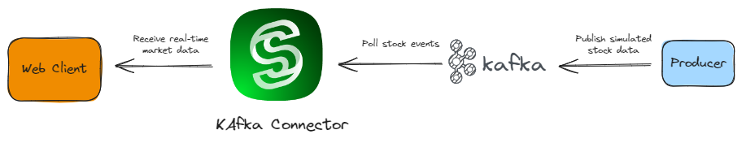
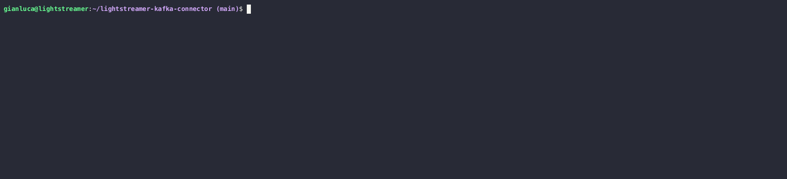

# Lightstreamer Kafka Connector

- [Lightstreamer Kafka Connector](#lightstreamer-kafka-connector)
  - [Introduction](#introduction)
  - [Features](#features)
  - [Quick Start](#quick-start)
    - [Run](#run)
  - [Installation](#installation)
    - [Requirements](#requirements)
    - [Deploy](#deploy)
    - [Configure](#configure)
      - [Connection with Confluent Cloud](#connection-with-confluent-cloud)
    - [Start](#start)
      - [Publishing with Confluent Cloud](#publishing-with-confluent-cloud)
  - [Configuration](#configuration)
    - [Global Settings](#global-settings)
      - [`adapter_conf['id']` - _Kafka Connector identifier_](#adapter_confid---kafka-connector-identifier)
      - [`adapter_class`](#adapter_class)
      - [`logging.configuration.path`](#loggingconfigurationpath)
    - [Connection Settings](#connection-settings)
      - [General Parameters](#general-parameters)
        - [`data_provider['name']` - _Kafka Connection Name_](#data_providername---kafka-connection-name)
        - [`adapter_class`](#adapter_class-1)
        - [`enable`](#enable)
        - [`bootstrap.servers`](#bootstrapservers)
        - [`group.id`](#groupid)
      - [Encryption Parameters](#encryption-parameters)
        - [`encryption.enable`](#encryptionenable)
        - [`encryption.protocol`](#encryptionprotocol)
        - [`encryption.enabled.protocols`](#encryptionenabledprotocols)
        - [`encryption.cipher.suites`](#encryptionciphersuites)
        - [`encryption.hostname.verification.enable`](#encryptionhostnameverificationenable)
        - [`encryption.truststore.path`](#encryptiontruststorepath)
        - [`encryption.truststore.password `](#encryptiontruststorepassword-)
        - [`encryption.keystore.enable`](#encryptionkeystoreenable)
        - [`encryption.keystore.path`](#encryptionkeystorepath)
        - [`encryption.keystore.password`](#encryptionkeystorepassword)
        - [`encryption.keystore.key.password`](#encryptionkeystorekeypassword)
        - [Quick Start SSL Example](#quick-start-ssl-example)
      - [Broker Authentication Parameters](#broker-authentication-parameters)
        - [`authentication.enable`](#authenticationenable)
        - [`authentication.mechanism`](#authenticationmechanism)
          - [`PLAIN`](#plain)
          - [`SCRAM-256`](#scram-256)
          - [`SCRAM-512`](#scram-512)
          - [`GSSAPI`](#gssapi)
        - [Quick Start Confluent Cloud Example](#quick-start-confluent-cloud-example)
      - [Topic Mapping](#topic-mapping)
        - [Record Routing](#record-routing)
      - [Record Mapping](#record-mapping)
        - [Smart Record Routing](#smart-record-routing)
      - [Record Evaluation](#record-evaluation)
        - [`record.consume.from`](#recordconsumefrom)
        - [`record.key.evaluator.type` and `record.value.evaluator.type`](#recordkeyevaluatortype-and-recordvalueevaluatortype)
        - [`record.key.evaluator.schema.path` and `record.value.evaluator.schema.path`](#recordkeyevaluatorschemapath-and-recordvalueevaluatorschemapath)
        - [`record.key.evaluator.schema.registry.enable` and `record.value.evaluator.schema.registry.enable`](#recordkeyevaluatorschemaregistryenable-and-recordvalueevaluatorschemaregistryenable)
        - [`record.extraction.error.strategy`](#recordextractionerrorstrategy)
      - [Schema Registry](#schema-registry)
        - [`schema.registry.url`](#schemaregistryurl)
        - [Encryption Parameters](#encryption-parameters-1)
        - [Quick Start Schema Registry Example](#quick-start-schema-registry-example)

## Introduction

The _Lightstreamer Kafka Connector_ is a ready-made pluggable Lighstreamer Adapter that enables event streaming from a Kafka broker to the internet.

[Insert Diagram here]

With Kafka Connector, any internet client connected to the Lightstreamer Server can consume events from Kafka topics like any other Kafka client. The Connector takes care of processing records received from Kafka to adapt and route them as real-time updates for the clients.

Kafka Connector allows to move high volume data out of Kafka by leveraging the battle-tested ability of the Lightstreamer real-time engine to deliver live data reliably and efficiently over internet protocols.

## Features

[...] TO TDO

## Quick Start

To rapidly showcase the functioning of the Lighstreamer Kafka Connector, the [`examples/quickstart`](examples/quickstart/) folder hosts all the stuff required to set up a quickstart app to display real-time market data received from Lightstreamer Server. The app is a modified version of the [Stock List](https://github.com/Lightstreamer/Lightstreamer-example-StockList-client-javascript?tab=readme-ov-file#basic-stock-list-demo---html-client) demo.



As you can see from the diagram above, in this variant the stream of simulated market events is injected from Kafka to the web client through the Ligthstreamer Kafka Connector.

To provide a complete stack, the app is based on _Docker Compose_. The [Docker Compose file](examples/quickstart/docker-compose.yml) comprises the following services:

1. _broker_, a Kafka broker, based on the [Confluent Local Docker Image](confluentinc/confluent-local:latest).
2. _kafka-connector_, Lighstreamer Server with Kafka Connector, based on the [Lightstreamer Kafka Connector Docker image example](examples/docker-image/). The service also includes the web client, mounted on `/lightstreamer/pages/QuickStart`.
4. _producer_, a native Kafka Producer, based on the provided [Dockerfile.producer](examples/quickstart/Dockerfile.producer) file and [kafka-connector-samples](kafka-connector-samples/) submodule of this repository.

### Run

To run the app:

1. Make sure you have Docker, Docker Compose, and Java 17 (or later) installed on your local machine.
2. From the [`examples/quickstart`](examples/quickstart/) folder, run the command:
   
   ```sh
   ./start.sh
   ...
   ⠏ Network quickstart_default  Created
   ✔ Container broker            Started
   ✔ Container producer          Started
   ✔ Container kafka-connector   Started
   ...
   Service started. Now you can point your browser to http://localhost:8080/QuickStart to see real-time data.
   ...
   ```

3. Once all containers are ready, point your browser to [http://localhost:8080/QuickStart](http://localhost:8080/QuickStart).
   
   After a few moments, the user interface starts displaying the real-time stock data.

4. To shutdown Docker Compose and clean up all temporary resources:
 
   ```sh
   ./stop.sh
   ```

## Installation

This section will guide you through the installation of the Lightstreamer Kafka Connector to get it up and running in a very short time.

### Requirements

- JDK version 17 or later.
- [Lightstreamer Server](https://lightstreamer.com/download/) version 7.4.2 or later (check the `LS_HOME/GETTING_STARTED.TXT` file for the instructions).
- A running Kafka broker or Kafka Cluster.

### Deploy

Get the deployment package from the [latest release page](https://github.com/Lightstreamer/Lightstreamer-kafka-connector/releases/latest). Alternatively, check out this repository and run the following command from the project root:

```sh
./gradlew distribuite
```

which generates the `lightstreamer-kafka-connector-deploy-<version>.zip` bundle under the `deploy` folder.

Then, unzip it into the `adapters` folder of the Lightstreamer Server installation.
Finally, check that the Lightstreamer layout looks like the following:

```sh
LS_HOME/
...
├── adapters
│   ├── lightstreamer-kafka-connector-<version>
│   │   ├── README.md
│   │   ├── adapters.xml
│   │   ├── log4j.properties
│   │   ├── lib
│   └── welcome_res
...
├── audit
├── bin
...
```

### Configure

Before starting Kafka Connector, you need to properly configure the `LS_HOME/adapters/lightstreamer-kafka-connector-<version>/adapters.xml` file. For convenience, the package comes with a predefined configuration (the same used in the [_Quick Start_](#quick-start) app), which can be customized in all its aspects as per your requirements. Of course, you may add as many different connection configurations as desired to fit your needs.

To quickly complete the installation and verify the successful integration with Kafka, edit the _data_provider_ block `QuickStart` in the file as follows:

- Update the [`bootstrap.servers`](#bootstrapservers) parameter with the connection string of Kafka.

  ```xml
  <param name="bootstrap.servers">kafka.connection.string</param>
  ```
- Optionally customize the `LS_HOME/adapters/lightstreamer-kafka-connector-<version>/log4j.properties` file (the current settings produce the additional `quickstart.log` file).

You can get more details about all possible settings in the [Configuration](#configuration) section.

#### Connection with Confluent Cloud

If your target Kafka cluster is Confluent Cloud, you also need to properly configure `TLS 1.2` encryption and `SASL_PLAIN` authentication, as follows:

```xml
<param name="encryption.enable">true</param>
<param name="encryption.protocol">TLSv1.2</param>
<param name="encryption.hostname.verification.enable">true</param>

<param name="authentication.enable">true</param>
<param name="authentication.mechanism">PLAIN</param>
<param name="authentication.username">API.key</param>
<param name="authentication.password">secret</param>
...
```

where you have to replace `API.key` and `secret` with the _API Key_ and _secret_ generated on the _Confluent CLI_ or from the _Confluent Cloud Console_.

### Start

1. Launch Lightstreamer Server
  
   From the `LS_HOME/bin/unix-like` directory, run the command: 

   ```sh
   ./start_background.sh
   ```

2. Attach a Lightstreamer Consumer.

   The [`kafka-connector-samples`](kafka-connector-samples/) submodule hosts a simple 
   Lightstreamer Java client that can be used to test the consumption of Kafka events from any Kafka topics.

   Since a generic Ligthstreamer client needs to subscribe to one or more items to receive real-time updates, Kafka Connector has to offer proper support to realize the mapping between Kafka topics and Lighstreamer items.

   The `QuickStart` [factory configuration](kafka-connector/src/connector/dist/adapters.xml#L39) comes with a simple mapping through the following settings:

   - An item template:
     ```xml
     <param name="item-template.stock">stock-#{index=KEY}</param>
     ```
     
     which defines the general format name of the items a client must subscribe to to receive updates from Kafka Connector. The optional _Bindable Selector Keys_ syntax used here, denoted within `#{...}`, can bind 
     every part of a Kafka Record to a variable set of input parameters. In this case, the input parameter `index` is bound to the `KEY` predefined constant, which extracts the key part of Kafka records.

   - A topic mapping:
     ```xml
     <param name="map.stocks.to">item-template.stock</param>
     ```
     which maps the topic `stocks` to the item names.

   This configuration instructs Kafka Connector to analyze every single event published to the topic `stocks` and check if it matches against any item subscribed by the client as:
      
   - `stock-[index=1]`, an item with the parameter `index` bound to a record key equal to `1`.
   - `stock-[index=2]`, an item with the parameter `index` bound to a record key equal to `2`.
   - ...
   - `stock-[index=<any record key>]`
   
   The _Kafka Connector_ will then route the event to any matched item.

   In addition, the following section defines how the record is mapped to the tabular form of Lightstreamer fields, by using an intuitive set of _Selector Keys_ (denoted with `#{..}`) through which each part of a Kafka Record can be extracted. In this case, the VALUE predefined constant extracts the value part of Kakfa records.

   ```xml
   <param name="field.stock_name">#{VALUE.name}</param>
   <param name="field.last_price">#{VALUE.last_price}</param>
   <param name="field.ask">#{VALUE.ask}</param>
   <param name="field.ask_quantity">#{VALUE.ask_quantity}</param>
   <param name="field.bid">#{VALUE.bid}</param>
   <param name="field.bid_quantity">#{VALUE.bid_quantity}</param>
   <param name="field.pct_change">#{VALUE.pct_change}</param>
   <param name="field.min">#{VALUE.min}</param>
   <param name="field.max">#{VALUE.max}</param>
   <param name="field.ref_price">#{VALUE.ref_price}</param>
   <param name="field.open_price">#{VALUE.open_price}</param>
   <param name="field.item_status">#{VALUE.item_status}</param>
   ```

   This way, the routed event is transformed into a flat structure, which can be forwarded to the clients.

   Before launching the consumer, you first need to build it with the command:

   ```sh
   ./gradlew distribuiteConsumer 
   ```

   which generates the `lightstreamer-kafka-connector-samples-consumer-all-<version>.jar` under the `deploy` folder.

   Then, launch it with:
   
   ```sh
   java -jar deploy/lightstreamer-kafka-connector-samples-consumer-all-<version>.jar --address http://localhost:8080 --adapter-set KafkaConnector --data-adapter QuickStart --items stock-[index=1] --fields ask,bid,min,max
   ```

   As you can see, you have to specify a few parameters:

   - `--address`, the Lightstreamer Server address.
   - `--adapter-set`, the name of the requested Adapter Set, which triggers Ligthtreamer to activate Kafka Connector deployed into the `adapters` folder.
   - `--data-adapter`, the name of the requested Data Adapter, which identifies the selected Kafka connection configuration.
   - `--items`, the list of items to subscribe to.
   - `--fields`, the list of requested fields for the items.

   **NOTE:** As the _Lightstreamer Kafka Connector_ is built around the [_Lightreamer Java In-Process Adapter SDK_](https://github.com/Lightstreamer/Lightstreamer-lib-adapter-java-inprocess), every remote client based on any _Lightstreamer Client SDK_ can therefore interact with it.

3. Publish Events.

   The [`kafka-connector-samples`](kafka-connector-samples/) submodule hosts a simple Kafka producer to publish simulated market events for the _QuickStart_ app.

   Before launching the producer, you first need to build it. Open a new shell and execute the command:

   ```sh
   ./gradlew distribuiteProducer 
   ```

   which generates the `lightstreamer-kafka-connector-samples-producer-all-<version>.jar` under the `deploy` folder.

   Then, launch it with:

   ```sh
   java -jar deploy/lightstreamer-kafka-connector-samples-producer-all-<version>.jar --bootstrap-servers <kafka.connection.string> --topic stocks
   ```

   #### Publishing with Confluent Cloud

   If your target Kafka cluster is Confluent Cloud, you also need to provide a properties file that includes encryption and authentication settings, as follows:

   ```java
   security.protocol=SASL_SSL
   sasl.jaas.config=org.apache.kafka.common.security.plain.PlainLoginModule required username='API.key' password='secret';
   sasl.mechanism=PLAIN
   ...
   ```

   where you have to replace `API.key` and `secret` with the _API Key_ and _secret_ generated on the _Confluent CLI_ or from the _Confluent Cloud Console_.

   ```sh
   java -jar deploy/lightstreamer-kafka-connector-samples-producer-all-<version>.jar --bootstrap-servers <kafka.connection.string> --topic stocks --config-file <path/to/config/file>
   ```

   

4. Check Consumed Events.

   After starting the publisher, you should immediately see the real-time updates flowing from the consumer shell:

   

## Configuration

As already anticipated, the Lightstreamer Kafka Connector is a Lightstreamer Adapter Set, which means it is made up of a Metadata Adapter and one or more Data Adapters, whose settings are defined in the `LS_HOME/adapters/lightstreamer-kafka-connector-<version>/adapters.xml` file.

The following sections will guide you through the configuration details.

### Global Settings

#### `adapter_conf['id']` - _Kafka Connector identifier_

  _Mandatory_. The `id` attribute of the `adapters_conf` root tag defines the _Kafka Connector identifier_, which will be used by the Clients to request this Adapter Set while setting up the connection to a Lighstreamer Server through a _LightstreamerClient_ object.

  The factory value is set to `KafkaConnector` for convenience, but you are free to change it as per your requirements.

  Example:

  ```xml
  <adapters_conf id="KafkaConnector">
  ```

#### `adapter_class`

_Mandatory_. The `adapter_class` tag, specified inside the `metadata_provider` block, defines the Java class name of the Metadata Adapter.

The factory value is set to `com.lightstreamer.kafka_connector.adapters.KafkaConnectorMetadataAdapter`, which implements the internal business of Kafka Connector.

It is possible to provide a custom implementation by extending this class: just package your new class in a jar file and deploy it along with all required dependencies into the `LS_HOME/adapters/lightstreamer-kafka-connector-<version>/lib` folder.

See the [Metadata Adapter Customization](#meta) section for more details.

Example:

```xml
...
<metadata_provider>
    ...
    <adapter_class>your.custom.class</adapter_class>
    ...
</metadata_provider>
...
```

#### `logging.configuration.path`

_Mandatory_. The path of the [reload4j](https://reload4j.qos.ch/) configuration file, relative to the deployment folder (`LS_HOME/adapters/lightstreamer-kafka-connector-<version>`).

The parameter is specified inside the `metadata_provider` block.

The factory value points to the predefined file `LS_HOME/adapters/lightstreamer-kafka-connector-<version>/log4g.properties`.

Example:

```xml
...
<metadata_provider>
    ...
    <param name="logging.configuration.path">log4j.properties</param>
    ...
</metadata_provider>
...
```

### Connection Settings

The Lightstreamer Kafka Connector allows the configuration of separate independent connections to different Kafka broker/clusters.

Every single connection is configured via the definition of its own Data Adapter through the `data_provider` block. At least one connection must be provided.

Since Kafka Connector manages the physical connection to Kafka by wrapping an internal Kafka Consumer, several configuration settings in the Data Adapter are identical to those required by the usual Kafka Consumer configuration.

#### General Parameters

##### `data_provider['name']` - _Kafka Connection Name_

_Optional_. The `name` attribute of the `data_provider` tag defines _Kafka Connection Name_, which will be used by the Clients to request real-time data from this specific Kafka connection through a _Subscription_ object.

Furthermore, the name is also used to group all logging messages belonging to the same connection.

> [!TIP]
> For every Data Adaper connection, add a new logger and its relative appender to `log4j.properties`, so that you can separate log files for each connection.  
> For example, the factory [logging configuration](kafka-connector/src/connector/dist/log4j.properties#L23) provides the logger `QuickStart` to print every log messages relative to the `QuickStart` connection:
> ```java
> ...
> # QuickStart logger
> log4j.appender.QuickStartFile=org.apache.log4j.RollingFileAppender
> log4j.appender.QuickStartFile.layout=org.apache.log4j.PatternLayout
> log4j.appender.QuickStartFile.layout.ConversionPattern=[%d] [%-10c{1}] %-5p %m%n
> log4j.appender.QuickStartFile.File=../../logs/quickstart.log
> ```

Example:

```xml
<data_provider name="BrokerConnection">
```

Default value: `DEFAULT`, but only one `DEFAULT` configuration is permitted.

##### `adapter_class`

_Mandatory_. The `adapter_class` tag defines the Java class name of the Data Adapter. DO NOT EDIT IT!.

Factory value: `com.lightstreamer.kafka_connector.adapters.KafkaConnectorAdapter`.

##### `enable`

_Optional_. Enable this connection configuration. Can be one of the following:
- `true`
- `false`

If disabled, Lightstreamer Server will automatically deny every subscription made to this connection.

Default value: `true`.

Example:

```xml
<param name="enable">false</param>
```

##### `bootstrap.servers`

_Mandatory_. The Kafka Cluster bootstrap server endpoint expressed as the list of host/port pairs used to establish the initial connection.

The parameter sets the value of the [`bootstrap.servers`](https://kafka.apache.org/documentation/#consumerconfigs_bootstrap.) key to configure the internal Kafka Consumer.

Example:

```xml
<param name="bootstrap.servers">broker:29092,broker:29093</param>
```

##### `group.id`

_Optional_. The name of the consumer group this connection belongs to.

The parameter sets the value for the [`group.id`](https://kafka.apache.org/documentation/#consumerconfigs_group.id) key to configure the internal Kafka Consumer.

Default value: _KafkaConnector Identifier_ + _Connection Name_ + _Randomly generated suffix_.

```xml
<param name="group.id">kafka-connector-group</param>
```

#### Encryption Parameters

A TCP secure connection to Kafka is configured through parameters with the prefix `encryption`.

##### `encryption.enable`

_Optional_. Enable encryption of this connection. Can be one of the following:
- `true`
- `false`

Default value: `false`.

Example:

```xml
<param name="encryption.enable">true</param>
```

##### `encryption.protocol`

_Optional_. The SSL protocol to be used. Can be one of the following:
- `TLSv1.2`
- `TLSv1.3`

Default value: `TLSv1.3` when running on Java 11 or newer, `TLSv1.2` otherwise.

Example:

```xml
<param name="encryption.protocol">TLSv1.2</param>
```

##### `encryption.enabled.protocols`

_Optional_. The list of enabled secure communication protocols.

Default value: `TLSv1.2,TLSv1.3` when running on Java 11 or newer, `TLSv1.2` otherwise.

Example:

```xml
<param name="encryption.enabled.protocols">TLSv1.3</param>
```

##### `encryption.cipher.suites`

_Optional_. The list of enabled secure cipher suites.

Default value: all the available cipher suites in the running JVM.

Example:

```xml
<param name="encryption.cipher.suites">TLS_ECDHE_RSA_WITH_AES_256_CBC_SHA,TLS_RSA_WITH_AES_256_CBC_SHA</param>
```

##### `encryption.hostname.verification.enable`

_Optional_. Enable hostname verification. Can be one of the following:

- `true`
- `false`

Default value: `false`.

Example:

```xml
<param name="encryption.hostname.verification.enable">true</param>
```

##### `encryption.truststore.path`

_Optional_. The path of the trust store file, relative to the deployment folder (`LS_HOME/adapters/lightstreamer-kafka-connector-<version>`).

Example:

```xml
<param name="encryption.truststore.path">secrets/kafka-connector.truststore.jks</param>
```

##### `encryption.truststore.password `

_Optional_. The password of the trust store.

If not set, checking the integrity of the trust store file configured will not be possible.

Example:

```xml
<param name="encryption.truststore.password">kafka-connector-truststore-password</param>
```


##### `encryption.keystore.enable`

_Optional_. Enable a key store. Can be one of the following:
- `true`
- `false`

A key store is required if the mutual TLS is enabled on Kafka.

If enabled, the following parameters configure the key store settings:

- `encryption.keystore.path`
- `encryption.keystore.password`
- `encryption.keystore.key.password`

Default value: `false`.

Example:

```xml
<param name="encryption.keystore.enable">true</param>
```

##### `encryption.keystore.path`

_Mandatory if [key store](#encryptionkeystoreenable) is enabled_. The path of the key store file, relative to the deployment folder (`LS_HOME/adapters/lightstreamer-kafka-connector-<version>`).

Example:

```xml
<param name="encryption.keystore.path">secrets/kafka-connector.keystore.jks</param>
```

##### `encryption.keystore.password`

_Optional_. The password of the key store.

If not set, checking the integrity of the key store file configured will not be possible.

Example:

```xml
<param name="encryption.keystore.password">keystore-password</param>
```

##### `encryption.keystore.key.password`

_Optional_. The password of the private key in the key store file.

Example:

```xml
<param name="encryption.keystore.key.password">kafka-connector-private-key-password</param>
```

##### Quick Start SSL Example

Check out the [adapters.xml](examples/quickstart-ssl/adapters.xml#L15) file of the [_Quick Start SSL_](examples/quickstart-ssl/) app, where you can find an example of encryption configuration.

#### Broker Authentication Parameters

Broker authentication is configured through parameters with the prefix `authentication`.

##### `authentication.enable`

_Optional_. Enable the authentication of this connection against the Kafka Cluster. Can be one of the following:
- `true`
- `false`

Default value: `false`.

Example:

```xml
<param name="authentication.enable">true</param>
```

##### `authentication.mechanism`

_Mandatory if [authentication](#authenticationenable) is enabled_. The SASL mechanism type. The Lightstreamer Kafka Connector supports the following authentication mechanisms:

- `PLAIN` (the default value)
- `SCRAM-256`
- `SCRAM-512`
- `GSSAPI`

In the case of `PLAIN`, `SCRAM-256`, and `SCRAM-512` mechanisms, the credentials must be configured through the following mandatory parameters (which are not allowed for `GSSAPI`):

- `authentication.username`, the username.
- `authentication.password`, the password.

###### `PLAIN`

Example:

```xml
<param name="authentication.enable">true</param>
<param name="authentication.mechanism">PLAIN</param>
<param name="authentication.username">authorized-kafka-user</param>
<param name="authentication.password">authorized-kafka-user-password</param>
```

###### `SCRAM-256`

Example: 

```xml
<param name="authentication.enable">true</param>
<param name="authentication.mechanism">SCRAM-256</param>
<param name="authentication.username">authorized-kafka-usee</param>
<param name="authentication.password">authorized-kafka-user-password</param>
```

###### `SCRAM-512`

Example:

```xml
<param name="authentication.enable">true</param>
<param name="authentication.mechanism">SCRAM-512</param>
<param name="authentication.username">authorized-kafka-username</param>
<param name="authentication.password">authorized-kafka-username-password</param>
```

###### `GSSAPI`

In the case of `GSSAPI` authentication mechanism, the following parameters will be part of the authentication configuration:

- `authentication.gssapi.key.tab.enable`

  _Optional_. Enable the use of a keytab. Can be one of the following:
  - `true`
  - `false`

  Default value: `false`.

- `authentication.gssapi.key.tab.path`

  _Mandatory if keytab is enabled_. The path to the kaytab file, relative to the deployment folder (`LS_HOME/adapters/lightstreamer-kafka-connector-<version>`).

- `authentication.gssapi.store.key.enable`

  _Optional_. Enable storage of the principal key. Can be one of the following:
  - `true`
  - `false`

  Default value: `false`.

  Default value: `false`.

- `authentication.gssapi.kerberos.service.name`

  _Mandatory_. The name of the Kerberos service.

- `authentication.gssapi.principal`

  _Mandatory if ticket cache is disabled_. The name of the principal to be used.

- `authentication.gssapi.ticket.cache.enable`

  _Optional_. Enable the use of a ticket cache. Can be one of the following:
  - `true`
  - `false`

  Default value: `false`.

Example:

```xml
...
<param name="authentication.enable">true</param>
<param name="authentication.mechanism">GSSAPI</param>
<param name="authentication.gssapi.key.tab.enable">true</param>
<param name="authentication.gssapi.key.tab.path">gssapi/kafka-connector.keytab</param>
<param name="authentication.gssapi.store.key.enable">true</param>
<param name="authentication.gssapi.kerberos.service.name">kafka</param>
<param name="authentication.gssapi.principal">kafka-connector-1@LIGHTSTREAMER.COM</param>
...
```

Example of configuration with the use of a ticket cache:

```xml
<param name="authentication.enable">true</param>
<param name="authentication.mechanism">GSSAPI</param>
<param name="authentication.gssapi.kerberos.service.name">kafka</param>
<param name="authentication.gssapi.ticket.cache.enable">true</param>
```

##### Quick Start Confluent Cloud Example

Check out the [adapters.xml](examples/quickstart-confluent-cloud/adapters.xml#L20) file of the [_Quick Start Confluent Cloud_](examples/quickstart-confluent-cloud/) app, where you can find an example of authentication configuration.

#### Topic Mapping

Kafka Connector provides extensive support for mapping Kafka topics to Lightstreamer items.

As anticipated in the [_Installation_](#start) section, Lightstreamer Kafka Connector provides support for mapping Kafka topics to Lightstreamer items. This way, Kafka events treams 

To extend the availability of Kafka events streams to a potentially huge amount of devices connected to Lighstreamer, Kafka Connector allows great flexibility in routing and manipulation strategies.

A Kafka record can be analyzed in all its aspects to extract the information that can be:
- routed to the designated Lightstreamer Items
- remapped to the specific Lightstreamer Fields

##### Record Routing

To configure the routing of Kafka event streams to Lightstreamer items, use the parameter `map.<topic>.to`. The general format is:
 
```xml
<param name="map.<topic-name>.to"><item1>,<item2>,<itemN>,...</param>
```
  
which defines the mapping between the source Kafka topic (`<topic-name>`) and the target items (`<item1>`, `<item2>`, `<itemN>`, etc.).

This configuration enables the implementation of various mapping scenarios, as shown by the following examples:

- _One To One_

  ```xml
  <param name="map.sample-topic.to">sample-item</param>
  ```

  This is the most straightforward scenario one may think of: every record published to the Kafka topic `sample-topic` will simply be routed to the Lighstreamer item `sample-item`. Therefore, messages will be immediately broadcasted as real-time updates to all clients subscribed to such an item.
  
- _One To Many_

  ```xml
  <param name="map.sample-topic.to">sample-item1,sample-item2,sample-item3</param>
  ```

  Every record published to the Kafka topic `sample-topic` will be routed to the Lighstreamer items `sample-item1`, `sample-item2`, and `sample-item3`.

  This scenario may activate unicast and multicast messaging, as it is possible to specify which item can be subscribed to by which user or group of users. To do that, it is required to provide a customized extension of the factory Metadata Adapter class (see the example), in which every subscription must be validated against the user identity.
 
- _Many to One_

  ```xml
  <param name="map.sample-topic1.to">sample-item</param>
  <param name="map.sample-topic2.to">sample-item</param>
  <param name="map.sample-topic3.to">sample-item</param>
  ```

  With this scenario, it is possible to broadcast to all clients subscribed to a single item (`sample-item`) every message published to different topics (`sample-topic1`, `sample-topic2`, `sample-topic3`). 

#### Record Mapping

To forward real-time updates to the Lighstreamer clients, a Kafka record must be mapped to Lighstreamer fields, which define the _schema_ of any Lighstreamer item.

To configure the mapping, you define the set of all subscribeable fields through parameters with the prefix `field.`:

```xml
<param name="field.fieldName1">expression1</param>
<param name="field.fieldName2">expression2<param>
...
<param name="field.fieldNameN">expressionN<param>
...
```

The field `fieldNameX` will contain the value extracted from the deserialized Kafka record through the `expressionX`. This approach makes it possible to transform a Kafka record structure of any complexity to the flat structure required by Lighstreamer.

To write an expression, Kafka Connector provides the _Data Extraction Language_. This language has a pretty minimal syntax, with the following basic rules:

- expressions must be enclosed within `#{...}`
- expressions use _Extraction Keys_, a set of predefined constants that reference specific parts of the record structure:

  - `#{KEY}`, the key
  - `#{VALUE}`, the value
  - `#{TIMESTAMP}`, the timestamp
  - `#{OFFSET}`, the offset
  - `#{PARTITION}`, the partition

- the _dot notation_ is used to access attributes or fields of record keys and record values serialized in JSON or Avro formats:

  ```js
  KEY.attribute1Name.attribute2Name...
  VALUE.attribute1Name.attribute2Name...
  ```

> [!IMPORTANT] 
> Currently, it is required that the top-level element of either a record key or record value is:
> - an [Object](https://www.json.org/json-en.html), in the case of JSON format
> - a [Record](https://avro.apache.org/docs/1.11.1/specification/#schema-record), in the case of Avro format
> 
> Such a constraint may be removed in a further version of Kafka Connector.

- the _square notation_ is used to access:

  - indexed attributes:
    
    ```js
    KEY.attribute1Name[i].attribute2Name...
    VALUE.attribute1Name[i].attribute2Name...
    ```
    where `i` is a 0-indexed value.

  - key-based attributes:

    ```js
    KEY.attribute1Name['keyName'].attribute2Name...
    VALUE.attribute1Name['keyName'].attribute2Name...
    ```
    where `keyName` is a string value.

> [!TIP]
> For JSON format, accessing a child attribute by dot notation or square bracket notation is equivalent: 
>
> ```js
> VALUE.myProperty.myChild.childProperty
> ```
> ```js
> VALUE.myProperty['myChild'].childProperty
> ```

- expressions must evaluate to a _scalar_ value, otherwise an error will be thrown during the extraction process (see record error evaluation strategy).

The QuickStart factory configuration file shows a basic example, where a simple _one-to-one_ mapping has been defined between an attribute of the JSON record value and a Lighstreamer field. Of course, thanks to the _data extraction language, more complex mapping can be employed.

```xml
<param name="field.stock_name">#{VALUE.name}</param>
<param name="field.last_price">#{VALUE.last_price}</param>
<param name="field.ask">#{VALUE.ask}</param>
<param name="field.ask_quantity">#{VALUE.ask_quantity}</param>
<param name="field.bid">#{VALUE.bid}</param>
<param name="field.bid_quantity">#{VALUE.bid_quantity}</param>
<param name="field.pct_change">#{VALUE.pct_change}</param>
<param name="field.min">#{VALUE.min}</param>
<param name="field.max">#{VALUE.max}</param>
<param name="field.ref_price">#{VALUE.ref_price}</param>
<param name="field.open_price">#{VALUE.open_price}</param>
<param name="field.item_status">#{VALUE.item_status}</param>
```

##### Smart Record Routing

Record routing can be made more efficient by the _Data Extraction Language_ feature of Kafka Connector. Rather, topics can be mapped not only to predefined items but even to a wider range of _dynamic_ items through the specification of an _item template_, which employs the _bindable extraction keys_ expressions.

Topics can be mapped not only to predefined items but even to a wider range of _dynamic_ items through the specification of an _item template_, which employs the _bindable extraction keys_ expressions.

To configure an item template, use the parameter `item-template.<template-name>`. The general format is:

```xml
<param name="item-template.<template-name>"><item-prefix>-<expression></param>
```
  
where
- `<template-name>` is the unique name used to reference the template in the topic mapping configurations. As an example, for the given item template definitions:
   
   ```xml
   <param name="item-template.template1">...</param>
   <param name="item-template.template2>">...</param>
   ``` 

   the following mappings can be configured:

   ```xml
   <param name="map.sample-topic">item-template.template1</param>
   <param name="map.other-topic">item-template.template1,item-template.template1</param>
   ``` 

> [!TIP]
> It is allows to mix reference to simple item names and item templates in the same topic mapping configurations:
>
> ```xml
> <param name="map.sample-topic">item-template.template1,item1,item2</param>
> ``` 

- `<prefix>` is the prefix of the item name
- `<expression>` is a _Bindable Extraction Key_ expression

   You write a bindable extraction keys expression as:

  ```js
  #{paramName1=<data extraction expression>,paramName2=<data extraction expression>},...
  ```

  where `paraName1`, `paramName2`, etc, represent parameters to be bound to the specified extraction expression.

  As an example, the following expression:

  ```js
  #{name=VALUE.name,age=VALUE.age}
  ```

  simply instructs Kafka Connector to bind the parameter `name` and `age` respectively to the extracted values of the field `name` and `age` of the Kafka record value.

The employment of the bindable expression keys enables the definition of dynamically subscribing items.

So, a topic mapping defined as follows:

```xml
<param name="item-template.sample">item-#{name=VALUE.name,age=VALUE.age}</param>
<param name="map.sample-topic.to">sample</param>
```

allows Lightstreamer Clients to subscribe to items like:

```js
item-[name=Joe,age=24]
item-[name=Anna,age=32]
item-[name=Bob,age=45]
```

to receive real-time updates only for those Kafka records which:

- published to the topic sample
- whose Record value 

While evaluating a Kakfa record, the field name and age of the record value get bound to the parameter `name` and age, which will be used later for the smart routing process

Resuming the _Quick Start_ app, the [factory configuration file](kafka-connector/src/connector/dist/adapters.xml#L39) defines the following item template:

```xml
<param name="item-template.stock">stock-#{index=KEY}</param>
```

which is made of:
- name: `stock`
- prefix: `stock`
- bindable expression key: #{index=KEY}

#### Record Evaluation

The Lightstreamer Kafka Connector offers wide support for deserializing Kafka records. Currently, it accepts the following formats:

- _Apache Avro_
- _JSON_
- _String_
- _Integer_
- _Float_

and other scalar types (see [the complete list](#recordkeyevaluatortype-and-recodvalueevaluatortype)).

In particular, Kafka Connector supports message validation for Avro and JSON, which can be specified through:

- Local schema files.
- The _Confluent Schema Registry_.

Kafka Connector supports independent deserialization of keys and values, which means that:

- Key and value can have different formats.
- Message validation against the Confluent Schema Registry can be enabled separately for the Kafka key and Kafka value (through [`record.key.evaluator.schema.registry.enable` and `record.value.evaluator.schema.registry.enable`](#recordkeyevaluatorschemaregistryenable-and-recordvalueevaluatorschemaregistryenable)).
- Message validation against local schema files must be specified separately for key and value (through the [`record.key.evaluator.schema.path` and `record.value.evaluator.schema.path`](#recordkeyevaluatorschemapath-and-recordvalueevaluatorschemapath))

**NOTE** For Avro, schema validation is required, therefore either a local schema file must be provided or the Confluent Schema Registry must be enabled.

In case of a validation failure, the Connector can react by ...

##### `record.consume.from`

_Optional_. The .... Can be one of the following:

- `LATEST`, Start consuming events from the latest available.
- `EARLIEST`, Start consuming events from the earliest available.

Default value: `LATEST`.

Example:

```xml
<param name="record.consme.from">EARLIEST</param>
```

##### `record.key.evaluator.type` and `record.value.evaluator.type`

_Optional_. The format to be used to deserialize respectively the key and value of a Kafka record. Can be one of the following:

- `AVRO`
- `JSON`
- `STRING`
- `INTEGER`
- `BOOLEAN`
- `BYTE_ARRAY`
- `BYTE_BUFFER`
- `BYTES`
- `DOUBLE`
- `FLOAT`
- `LONG`
- `SHORT`
- `UUID`

Default value: `STRING`.

Examples:

```xml
<param name="record.key.evaluator.type">INTEGER</param>
<param name="record.value.evaluator.type">JSON</param>
```

##### `record.key.evaluator.schema.path` and `record.value.evaluator.schema.path`

The path of the local schema file for message validation respectively of the Kafka key and the Kafa value.

```xml
<param name="record.key.evaluator.schema.path">schema/record_key.json</param>
<param name="record.value.evaluator.schema.path">schemas/record_value.json</param>
```

##### `record.key.evaluator.schema.registry.enable` and `record.value.evaluator.schema.registry.enable`

Enable the use of the [Confluent Schema Registry](#schema-registry) for validation respectively of the Kafka key and the Kafa value.

Default value: `false`.

Example:

```xml
<param name="record.key.evaluator.schema.registry.enable">true</param>
<param name="record.value.evaluator.schema.registry.enable">true</param>
```

##### `record.extraction.error.strategy`

_Optional_. The error handling strategy to be used if an error occurs while extracting data from incoming records. Can be one of the following:

- `IGNORE_AND_CONTINUE`, ignore the error and continue to process the next record.
- `FORCE_UNSUBSCRIPTION`, stop processing records and force unsubscription of the items requested by all the Clients subscribed to this connection.

Default value: `IGNORE_AND_CONTINUE`.

Example:

```xml
<param name="record.extraction.error.strategy">FORCE_UNSUBSCRIPTION</param>
```

#### Schema Registry

A _Schema Registry_ is a centralized repository that manages and validates schemas, which define the structure of valid messages.

Lightstreamer Kafka Connector supports integration with the [_Confluent Schema Registry_](https://docs.confluent.io/platform/current/schema-registry/index.html), through the configuration of parameters with the prefix `schema.registry`.

##### `schema.registry.url`

_Mandatory_. The URL of the Confluent Schema Registry. An encrypted connection is enabled by specifying the `https` protocol.

Example of a plain http URL:

```xml
<!-- Use https to enable secure connection to the registry
<param name="schema.registry.url">https://localhost:8081</param>
-->
<param name="schema.registry.url">http//localhost:8081</param>
```

##### Encryption Parameters

A secure connection to the Confluent Schema Registry can be configured through parameters with the prefix `schema.registry.encryption`, each one having the same meaning as the homologous parameters defined in the [Encryption Parameters](#encryption-parameters) section:

- `schema.registry.encryption.protocol` (see [encryption.protocol](#encryptionprotocol))
- `schema.registry.encryption.enabled.protocols` (see [encryption.enabled.protocols](#encryptionenabledprotocols))
- `schema.registry.encryption.cipher.suites` (see [encryption.cipher.suites](#encryptionciphersuites))
- `schema.registry.encryption.truststore.path` (see [encryption.truststore.path](#encryptiontruststorepath))
- `schema.registry.encryption.truststore.password` (see [encryption.truststore.password](#encryptiontruststorepassword))
- `schema.registry.encryption.hostname.verification.enable` (see [encryption.hostname.verification.enable](#encryptionhostnameverificationenable))
- `schema.registry.encryption.keystore.enable` (see [encryption.keystore.enable](#encryptionkeystoreenable))
- `schema.registry.encryption.keystore.path` (see [encryption.keystore.path](#encryptionkeystorepath))
- `schema.registry.encryption.keystore.password` (see [encryption.keystore.password](#encryptionkeystorepassword))
- `schema.registry.encryption.keystore.key.password` (see [encryption.keystore.key.password](#encryptionkeystorekeypassword))

Example:

```xml
<!-- Set the Confluent Schema registry URL -->
<param name="schema.registry.url">https//localhost:8081</param>

<!-- Set general encryption settings -->
<param name="schema.registry.encryption.enabled.protocols">TLSv1.3</param>
<param name="schema.registry.encryption.cipher.suites">TLS_ECDHE_RSA_WITH_AES_256_CBC_SHA,TLS_RSA_WITH_AES_256_CBC_SHA</param>
<param name="schema.registry.encryption.hostname.verification.enable">true</param>

<!-- If required, configure the trust store to trust the Confluent Schema registry certificates -->
<param name="schema.registry.encryption.truststore.path">secrets/secrets/kafka.connector.schema.registry.truststore.jks</param></param>

<!-- If mutual TLS is enabled on the Confluent Schema registry, enable and configure the key store -->
<param name="schema.registry.encryption.keystore.enable">true</param>
<param name="schema.registry.encryption.keystore.path">secrets/kafka-connector.keystore.jks</param>
<param name="schema.registry.encryption.keystore.password">kafka-connector-password</param>
<param name="schema.registry.encryption.keystore.key.password">schemaregistry-private-key-password</param>
```

##### Quick Start Schema Registry Example

Check out the [adapters.xml](examples/quickstart-schema-registry/adapters.xml#L36) file of the [_Quick Start Schema Registry_](examples/quickstart-schema-registry/) app, where you can find an example of Schema Registry settings.
