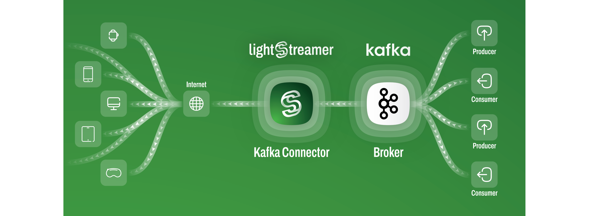
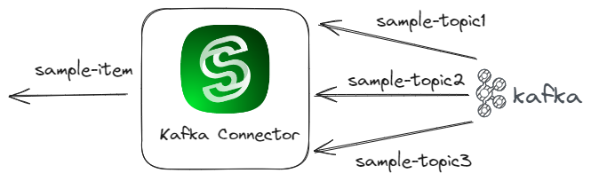

# Lightstreamer Kafka Connector
_Extend Kafka topics to the web effortlessly. Stream real-time data to mobile and web apps, anywhere. Scale Kafka to millions of clients._

- [Introduction](#introduction)
  - [Features](#features)
- [Quick Start: Set up in 5 minutes](#quick-start-set-up-in-5-minutes)
  - [Run](#run)
- [Installation](#installation)
  - [Requirements](#requirements)
  - [Deploy](#deploy)
  - [Configure](#configure)
    - [Connection with Confluent Cloud](#connection-with-confluent-cloud)
    - [Connection with Redpanda Cloud](#connection-with-redpanda-cloud)
  - [Start](#start)
    - [Publishing with Confluent Cloud](#publishing-with-confluent-cloud)
    - [Publishing with Redpanda Cloud](#publishing-with-redpanda-cloud)
- [Configuration](#configuration)
  - [Global Settings](#global-settings)
  - [Connection Settings](#connection-settings)
    - [General Parameters](#general-parameters)
    - [Encryption Parameters](#encryption-parameters)
    - [Broker Authentication Parameters](#broker-authentication-parameters)
    - [Record Evaluation](#record-evaluation)
    - [Topic Mapping](#topic-mapping)
      - [Data Extraction Language](#data-extraction-language)
      - [Record Routing (`map.<topic>.to`)](#record-routing-maptopicto)
      - [Record Mapping (`field.<fieldName>`)](#record-mapping-fieldfieldname)
      - [Filtered Record Routing (`item-template.<template-name>`)](#filtered-record-routing-item-templatetemplate-name)
    - [Schema Registry](#schema-registry)
      - [`schema.registry.url`](#schemaregistryurl)
      - [Encryption Parameters](#encryption-parameters-1)
      - [Quick Start Schema Registry Example](#quick-start-schema-registry-example)
- [Customize the Kafka Connector Metadata Adapter Class](#customize-the-kafka-connector-metadata-adapter-class)
  - [Develop the Extension](#develop-the-extension)
- [Kafka Lightstreamer Sink Connector](#kafka-connect-lightstreamer-sink-connector)
  - [Usage](#usage)
    - [Lightstreamer Setup](#lightstreamer-setup)
    - [Running](#running)
    - [Running in Docker](#running-in-docker)
  - [Configuration Reference](#configuration-reference)
- [Docs](#docs)
- [Examples](#examples)

## Introduction

Are you struggling to stream Apache Kafka® events to remote mobile and web applications?
_Lightstreamer Kafka Connector_ is an intelligent proxy that bridges the gap between Kafka and the web/mobile frontier, tackling the "last mile" challenge and ensuring your data transcends edge and boundary constraints.



### Features

- **Intelligent streaming & adaptive throttling**: Optimize data flow with intelligent bandwidth management. Adapt real-time data streaming over Kafka topics to accommodate the network connection quality of each remote client.
- **Massive scalability**: Connect millions of clients without compromising performance. Fanout real-time messages published on Kafka topics efficiently, preventing overload on the Kafka brokers. Check out the [load tests performed on Lightstreamer Kafka Connector vs. plain Kafka](https://github.com/Lightstreamer/lightstreamer-kafka-connector-loadtest).
- **Firewall and proxy traversal**: Ensure the delivery of real-time data to clients anywhere, navigating through network obstacles. Stream data seamlessly, even through the strictest corporate firewalls.
- **Maximum security**: Implement state-of-the-art encryption, authentication, and fine-grained authorization for robust protection.
- **Extensive broker compatibility**: Compatible with all leading brokers, including Apache Kafka, Confluent Platform, Confluent Cloud, Redpanda, Aiven and Amazon MSK.
- **Comprehensive client SDK support**:

  

To address the unique challenges faced by IT and development teams in integrating Kafka streams with web and mobile applications, Lightstreamer Kafka Connector provides a set of advanced functionalities. It is designed to facilitate real-time data distribution and enhance operational efficiency, allowing developers to focus more on core product features rather than on resolving connectivity and scalability concerns. With its straightforward setup and compatibility with existing Kafka infrastructures, the connector simplifies the extension of Kafka capabilities to a broader range of devices and platforms, creating a seamless link between complex backend systems and user-facing applications deployed over the internet.

## Quick Start: Set up in 5 minutes

To efficiently showcase the functionalities of Lightstreamer Kafka Connector, we have prepared an accessible quickstart application located in the [`examples/quickstart`](examples/quickstart/) directory. This streamlined application facilitates real-time streaming of data from a Kafka topic directly to a web interface. It leverages a modified version of the [Stock List Demo](https://github.com/Lightstreamer/Lightstreamer-example-StockList-client-javascript?tab=readme-ov-file#basic-stock-list-demo---html-client), specifically adapted to demonstrate Kafka integration. This setup is designed for rapid comprehension, enabling you to swiftly grasp and observe the connector's performance in a real-world scenario.


The diagram above illustrates how, in this setup, a stream of simulated market events is channeled from Kafka to the web client via Lightstreamer Kafka Connector.

To provide a complete stack, the app is based on _Docker Compose_. The [Docker Compose file](examples/quickstart/docker-compose.yml) comprises the following services:

1. _broker_: a Kafka broker, based on the [Docker Image for Apache Kafka](https://kafka.apache.org/documentation/#docker). Please notice that other versions of this quickstart are availbale in the in the [`examples`](examples/) directory, specifically targeted to other brokers, including [`Confluent Cloud`](examples/quickstart-confluent-cloud/), [`Redpanda Serverless`](examples/quickstart-redpanda-serverless), [`Redpanda Self-hosted`](examples/quickstart-redpanda-selfhosted), [`Aiven`](examples/quickstart-aiven), and more.
2. _kafka-connector_: Lightstreamer Server with Kafka Connector, based on the [Lightstreamer Kafka Connector Docker image example](examples/docker/), which also includes a web client mounted on `/lightstreamer/pages/QuickStart`
3. _producer_: a native Kafka Producer, based on the provided [`Dockerfile`](examples/quickstart-producer/Dockerfile) file from the [`quickstart-producer`](examples/quickstart-producer/) producer sample client

### Run

1. Make sure you have Docker, Docker Compose, and Java 17 (or later) installed on your local machine.
2. From the [`examples/quickstart`](examples/quickstart/) folder, run the following:

   ```sh
   $ ./start.sh
   ...
    ⠏ Network quickstart_default  Created
    ✔ Container broker            Started
    ✔ Container producer          Started
    ✔ Container kafka-connector   Started
   ...
   Services started. Now you can point your browser to http://localhost:8080/QuickStart to see real-time data.
   ...
   ```

3. Once all containers are ready, point your browser to [http://localhost:8080/QuickStart](http://localhost:8080/QuickStart).

4. After a few moments, the user interface starts displaying the real-time stock data.

   

5. To shutdown Docker Compose and clean up all temporary resources:

   ```sh
   $ ./stop.sh
   ```

## Installation

This section will guide you through the installation of Kafka Connector to get it up and running in a very short time.

### Requirements

- JDK version 17 or later
- [Lightstreamer Server](https://lightstreamer.com/download/) version 7.4.2 or later (check the `LS_HOME/GETTING_STARTED.TXT` file for the instructions)
- A running Kafka broker or Kafka Cluster

### Deploy

Download the deployment archive `lightstreamer-kafka-connector-<version>.zip` from the [Releases](https://github.com/Lightstreamer/Lightstreamer-kafka-connector/releases/) page. Alternatively, check out this repository and execute the following command from the [`kafka-connector-project`](kafka-connector-project/) folder:

```sh
$ ./gradlew adapterDistZip
```

which generates the archive file under the `kafka-connector-project/kafka-connector/build/distributions` folder.

Then, unpack it into the `adapters` folder of the Lightstreamer Server installation:

```sh
$ unzip lightstreamer-kafka-connector-<version>.zip -d LS_HOME/adapters
```

Finally, check that the Lightstreamer layout looks like the following:

```sh
LS_HOME/
...
├── adapters
│   ├── lightstreamer-kafka-connector-<version>
│   │   ├── LICENSE
│   │   ├── README.md
│   │   ├── adapters.xml
│   │   ├── javadoc
│   │   ├── lib
│   │   ├── log4j.properties
│   └── welcome_res
...
├── audit
├── bin
...
```

### Configure

Before starting Kafka Connector, you need to properly configure the `LS_HOME/adapters/lightstreamer-kafka-connector-<version>/adapters.xml` file. For convenience, the package comes with a predefined configuration (the same used in the [_Quick Start_](#quick-start) app), which can be customized in all its aspects as per your requirements. Of course, you may add as many different connection configurations as desired to fit your needs.

To quickly complete the installation and verify the successful integration with Kafka, edit the _data_provider_ block `QuickStart` in the file as follows:

- Update the [`bootstrap.servers`](#bootstrapservers) parameter with the connection string of Kafka:

  ```xml
  <param name="bootstrap.servers">kafka.connection.string</param>
  ```

- Optionally customize the `LS_HOME/adapters/lightstreamer-kafka-connector-<version>/log4j.properties` file (the current settings produce the additional `quickstart.log` file).

- Configure topic and record mapping.

  Since a generic Ligthstreamer client needs to subscribe to one or more items to receive real-time updates, Kafka Connector has to offer proper mechanisms to realize the mapping between Kafka topics and Lightstreamer items.

  The `QuickStart` [factory configuration](kafka-connector-project/kafka-connector/src/adapter/dist/adapters.xml#L39) comes with a simple mapping through the following settings:

  - An item template:
    ```xml
    <param name="item-template.stock">stock-#{index=KEY}</param>
    ```

    which defines the general format name of the items a client must subscribe to to receive updates from Kafka Connector. The [_extraction expression_](#filtered-record-routing-item-templatetemplate-name) syntax used here - denoted within `#{...}` -  permits the clients to specify filtering values to be compared against the actual contents of a Kafka record, evaluated through [_Extraction Keys_](#record-mapping-fieldfieldname) used to extract each part of a record. In this case, the `KEY` predefined constant extracts the key part of Kafka records.

  - A topic mapping:
    ```xml
    <param name="map.stocks.to">item-template.stock</param>
    ```
    which maps the topic `stocks` to the provided item template.

  This configuration instructs Kafka Connector to analyze every single event published to the topic `stocks` and check if it matches against any item subscribed by the client as:

  - `stock-[index=1]`: an item with the `index` parameter bound to a record key equal to `1`
  - `stock-[index=2]`: an item with the `index` parameter bound to a record key equal to `2`
  - ...

  Kafka Connector will then route the event to all matched items.

  In addition, the following section defines how to map the record to the tabular form of Lightstreamer fields, by using the aforementioned _Extraction Keys_. In this case, the `VALUE` predefined constant extracts the value part of Kafka records.

  ```xml
  <param name="field.stock_name">#{VALUE.name}</param>
  <param name="field.last_price">#{VALUE.last_price}</param>
  <param name="field.ask">#{VALUE.ask}</param>
  <param name="field.ask_quantity">#{VALUE.ask_quantity}</param>
  <param name="field.bid">#{VALUE.bid}</param>
  <param name="field.bid_quantity">#{VALUE.bid_quantity}</param>
  <param name="field.pct_change">#{VALUE.pct_change}</param>
  <param name="field.min">#{VALUE.min}</param>
  <param name="field.max">#{VALUE.max}</param>
  <param name="field.ref_price">#{VALUE.ref_price}</param>
  <param name="field.open_price">#{VALUE.open_price}</param>
  <param name="field.item_status">#{VALUE.item_status}</param>
  ```

  This way, the routed event is transformed into a flat structure, which can be forwarded to the clients.

You can get more details about all possible settings in the [Configuration](#configuration) section.

#### Connection with Confluent Cloud

If your target Kafka cluster is _Confluent Cloud_, you also need to properly configure TLS 1.2 encryption and SASL/PLAIN authentication, as follows:

```xml
<param name="encryption.enable">true</param>
<param name="encryption.protocol">TLSv1.2</param>
<param name="encryption.hostname.verification.enable">true</param>

<param name="authentication.enable">true</param>
<param name="authentication.mechanism">PLAIN</param>
<param name="authentication.username">API.key</param>
<param name="authentication.password">secret</param>
...
```

where you have to replace `API.key` and `secret` with the _API Key_ and _secret_ generated on the _Confluent CLI_ or from the _Confluent Cloud Console_.

#### Connection with Redpanda Cloud

If your target Kafka cluster is _Redpanda Cloud_, you also need to properly configure TLS 1.2 encryption and SASL/SCRAM authentication, as follows:

```xml
<param name="encryption.enable">true</param>
<param name="encryption.protocol">TLSv1.2</param>
<param name="encryption.hostname.verification.enable">true</param>

<param name="authentication.enable">true</param>
<param name="authentication.mechanism">SCRAM-SHA-256</param>
<!-- <param name="authentication.mechanism">SCRAM-SHA-512</param> -->
<param name="authentication.username">username</param>
<param name="authentication.password">password</param>
...
```

where you have to replace `username` and `password` with the credentials generated from the _Redpanda Console_.

### Start

1. Launch Lightstreamer Server.

   From the `LS_HOME/bin/unix-like` directory, run the following:

   ```sh
   $ ./background_start.sh
   ```

2. Attach a Lightstreamer consumer.

   The [`kafka-connector-utils`](kafka-connector-project/kafka-connector-utils) submodule hosts a simple Lightstreamer Java client that can be used to test the consumption of Kafka events from any Kafka topics.

   Before launching the consumer, you first need to build it from the [`kafka-connector-project`](kafka-connector-project/) folder with the command:

   ```sh
   $ ./gradlew kafka-connector-utils:build
   ```

   which generates the `lightstreamer-kafka-connector-utils-consumer-all-<version>.jar` file under the `kafka-connector-project/kafka-connector-utils/build/libs` folder.

   Then, launch it with:

   ```sh
   $ java -jar kafka-connector-utils/build/libs/lightstreamer-kafka-connector-utils-consumer-all-<version>.jar --address http://localhost:8080 --adapter-set KafkaConnector --data-adapter QuickStart --items stock-[index=1],stock-[index=2],stock-[index=3] --fields ask,bid,min,max
   ```

   As you can see, you have to specify a few parameters:

   - `--address`: the Lightstreamer Server address
   - `--adapter-set`: the name of the requested Adapter Set, which triggers Ligthtreamer to activate Kafka Connector deployed into the `adapters` folder
   - `--data-adapter`: the name of the requested Data Adapter, which identifies the selected Kafka connection configuration
   - `--items`: the list of items to subscribe to
   - `--fields`: the list of requested fields for the items

  > [!NOTE]
  > While we've provided examples in JavaScript (suitable for web browsers) and Java (geared towards desktop applications), you are encouraged to utilize any of the [Lightstreamer client SDKs](https://lightstreamer.com/download/#client-sdks) for developing clients in other environments, including iOS, Android, Python, and more.

3. Publish the events.

   The [`examples/quickstart-producer`](examples/quickstart-producer/) folder hosts a simple Kafka producer to publish simulated market events for the _QuickStart_ app.

   Before launching the producer, you first need to build it. Open a new shell from the folder and execute the command:

   ```sh
   $ cd examples/quickstart-producer
   $ ./gradlew build
   ```

   which generates the `quickstart-producer-all.jar` file under the `build/libs` folder.

   Then, launch it with:

   ```sh
   $ java -jar build/libs/quickstart-producer-all.jar --bootstrap-servers <kafka.connection.string> --topic stocks
   ```

   

   #### Publishing with Confluent Cloud

   If your target Kafka cluster is _Confluent Cloud_, you also need to provide a properties file that includes encryption and authentication settings, as follows:

   ```java
   security.protocol=SASL_SSL
   sasl.jaas.config=org.apache.kafka.common.security.plain.PlainLoginModule required username="<API.key>" password="<secret>";
   sasl.mechanism=PLAIN
   ...
   ```

   where you have to replace `<API.key>` and `<secret>` with the _API Key_ and _secret_ generated on the _Confluent CLI_ or from the _Confluent Cloud Console_.

   ```sh
   $ java -jar build/libs/quickstart-producer-all.jar --bootstrap-servers <kafka.connection.string> --topic stocks --config-file <path/to/config/file>
   ```

   #### Publishing with Redpanda Cloud

   If your target Kafka cluster is _Redpanda Cloud_, you also need to provide a properties file that includes encryption and authentication settings, as follows:

   ```java
   security.protocol=SASL_SSL
   sasl.jaas.config=org.apache.kafka.common.security.scram.ScramLoginModule required username="username" password="password";
   sasl.mechanism=SCRAM-SHA-256
   #sasl.mechanism=SCRAM-SHA-512
   ...
   ```

   where you have to replace `username` and `password` with the credentials generated from the _Redpanda Console_, and specify the configured SASL mechanism (`SCRAM-SHA-256` or `SCRAM-SHA-512`).

   ```sh
   $ java -jar build/libs/quickstart-producer-all.jar --bootstrap-servers <kafka.connection.string> --topic stocks --config-file <path/to/config/file>
   ```

4. Check the consumed events.

   After starting the publisher, you should immediately see the real-time updates flowing from the consumer shell:

   

## Configuration

As already anticipated, Kafka Connector is a Lightstreamer Adapter Set, which means it is made up of a Metadata Adapter and one or more Data Adapters, whose settings are defined in the `LS_HOME/adapters/lightstreamer-kafka-connector-<version>/adapters.xml` file.

The following sections will guide you through the configuration details.

### Global Settings

#### `adapter_conf['id']` - _Kafka Connector Identifier_

  _Mandatory_. The `id` attribute of the `adapters_conf` root tag defines the _Kafka Connector Identifier_, which will be used by the Clients to request this Adapter Set while setting up the connection to a Lightstreamer Server through a _LightstreamerClient_ object.

  The factory value is set to `KafkaConnector` for convenience, but you are free to change it as per your requirements.

  Example:

  ```xml
  <adapters_conf id="KafkaConnector">
  ```

#### `adapter_class`

_Mandatory_. The `adapter_class` tag, specified inside the _metadata_provider_ block, defines the Java class name of the Metadata Adapter.

The factory value is set to `com.lightstreamer.kafka.adapters.pub.KafkaConnectorMetadataAdapter`, which implements the internal business of Kafka Connector.

It is possible to provide a custom implementation by extending this class: just package your new class in a jar file and deploy it along with all required dependencies into the `LS_HOME/adapters/lightstreamer-kafka-connector-<version>/lib` folder.

See the [Customize the Kafka Connector Metadata Class](#customize-the-kafkaconnector-metadata-adapter-class) section for more details.

Example:

```xml
...
<metadata_provider>
    ...
    <adapter_class>your.custom.class</adapter_class>
    ...
</metadata_provider>
...
```

#### `logging.configuration.path`

_Mandatory_. The path of the [reload4j](https://reload4j.qos.ch/) configuration file, relative to the deployment folder (`LS_HOME/adapters/lightstreamer-kafka-connector-<version>`).

The parameter is specified inside the _metadata_provider_ block.

The factory value points to the predefined file `LS_HOME/adapters/lightstreamer-kafka-connector-<version>/log4g.properties`.

Example:

```xml
...
<metadata_provider>
    ...
    <param name="logging.configuration.path">log4j.properties</param>
    ...
</metadata_provider>
...
```

### Connection Settings

Kafka Connector allows the configuration of separate independent connections to different Kafka brokers/clusters.

Every single connection is configured via the definition of its own Data Adapter through the _data_provider_ block. At least one connection must be provided.

Since Kafka Connector manages the physical connection to Kafka by wrapping an internal Kafka Consumer, several configuration settings in the Data Adapter are identical to those required by the usual Kafka Consumer configuration.

#### General Parameters

##### `data_provider['name']` - _Kafka Connection Name_

_Optional_. The `name` attribute of the `data_provider` tag defines _Kafka Connection Name_, which will be used by the Clients to request real-time data from this specific Kafka connection through a _Subscription_ object.

Furthermore, the name is also used to group all logging messages belonging to the same connection.

> [!TIP]
> For every Data Adaper connection, add a new logger and its relative file appender to `log4j.properties`, so that you can log to dedicated files all the interactions pertinent to the connection with the Kafka cluster and the message retrieval operations, along with their routing to the subscribed items.
> For example, the factory [logging configuration](kafka-connector-project/dist/log4j.properties#L23) provides the logger `QuickStart` to print every log messages relative to the `QuickStart` connection:
> ```java
> ...
> # QuickStart logger
> log4j.appender.QuickStartFile=org.apache.log4j.RollingFileAppender
> log4j.appender.QuickStartFile.layout=org.apache.log4j.PatternLayout
> log4j.appender.QuickStartFile.layout.ConversionPattern=[%d] [%-10c{1}] %-5p %m%n
> log4j.appender.QuickStartFile.File=../../logs/quickstart.log
> ```

Example:

```xml
<data_provider name="BrokerConnection">
```

Default value: `DEFAULT`, but only one `DEFAULT` configuration is permitted.

##### `adapter_class`

_Mandatory_. The `adapter_class` tag defines the Java class name of the Data Adapter. DO NOT EDIT IT!.

Factory value: `com.lightstreamer.kafka.adapters.KafkaConnectorDataAdapter`.

##### `enable`

_Optional_. Enable this connection configuration. Can be one of the following:
- `true`
- `false`

If disabled, Lightstreamer Server will automatically deny every subscription made to this connection.

Default value: `true`.

Example:

```xml
<param name="enable">false</param>
```

##### `bootstrap.servers`

_Mandatory_. The Kafka Cluster bootstrap server endpoint expressed as the list of host/port pairs used to establish the initial connection.

The parameter sets the value of the [`bootstrap.servers`](https://kafka.apache.org/documentation/#consumerconfigs_bootstrap.servers) key to configure the internal Kafka Consumer.

Example:

```xml
<param name="bootstrap.servers">broker:29092,broker:29093</param>
```

##### `group.id`

_Optional_. The name of the consumer group this connection belongs to.

The parameter sets the value for the [`group.id`](https://kafka.apache.org/documentation/#consumerconfigs_group.id) key to configure the internal Kafka Consumer.

Default value: _Kafka Connector Identifier_ + _Connection Name_ + _Randomly generated suffix_.

```xml
<param name="group.id">kafka-connector-group</param>
```

#### Encryption Parameters

A TCP secure connection to Kafka is configured through parameters with the prefix `encryption`.

##### `encryption.enable`

_Optional_. Enable encryption of this connection. Can be one of the following:
- `true`
- `false`

Default value: `false`.

Example:

```xml
<param name="encryption.enable">true</param>
```

##### `encryption.protocol`

_Optional_. The SSL protocol to be used. Can be one of the following:
- `TLSv1.2`
- `TLSv1.3`

Default value: `TLSv1.3` when running on Java 11 or newer, `TLSv1.2` otherwise.

Example:

```xml
<param name="encryption.protocol">TLSv1.2</param>
```

##### `encryption.enabled.protocols`

_Optional_. The list of enabled secure communication protocols.

Default value: `TLSv1.2,TLSv1.3` when running on Java 11 or newer, `TLSv1.2` otherwise.

Example:

```xml
<param name="encryption.enabled.protocols">TLSv1.3</param>
```

##### `encryption.cipher.suites`

_Optional_. The list of enabled secure cipher suites.

Default value: all the available cipher suites in the running JVM.

Example:

```xml
<param name="encryption.cipher.suites">TLS_ECDHE_RSA_WITH_AES_256_CBC_SHA,TLS_RSA_WITH_AES_256_CBC_SHA</param>
```

##### `encryption.hostname.verification.enable`

_Optional_. Enable hostname verification. Can be one of the following:
- `true`
- `false`

Default value: `false`.

Example:

```xml
<param name="encryption.hostname.verification.enable">true</param>
```

##### `encryption.truststore.path`

_Optional_. The path of the trust store file, relative to the deployment folder (`LS_HOME/adapters/lightstreamer-kafka-connector-<version>`).

Example:

```xml
<param name="encryption.truststore.path">secrets/kafka-connector.truststore.jks</param>
```

##### `encryption.truststore.password `

_Optional_. The password of the trust store.

If not set, checking the integrity of the trust store file configured will not be possible.

Example:

```xml
<param name="encryption.truststore.password">kafka-connector-truststore-password</param>
```

##### `encryption.keystore.enable`

_Optional_. Enable a key store. Can be one of the following:
- `true`
- `false`

A key store is required if the mutual TLS is enabled on Kafka.

If enabled, the following parameters configure the key store settings:

- `encryption.keystore.path`
- `encryption.keystore.password`
- `encryption.keystore.key.password`

Default value: `false`.

Example:

```xml
<param name="encryption.keystore.enable">true</param>
```

##### `encryption.keystore.path`

_Mandatory if [key store](#encryptionkeystoreenable) is enabled_. The path of the key store file, relative to the deployment folder (`LS_HOME/adapters/lightstreamer-kafka-connector-<version>`).

Example:

```xml
<param name="encryption.keystore.path">secrets/kafka-connector.keystore.jks</param>
```

##### `encryption.keystore.password`

_Optional_. The password of the key store.

If not set, checking the integrity of the key store file configured will not be possible.

Example:

```xml
<param name="encryption.keystore.password">keystore-password</param>
```

##### `encryption.keystore.key.password`

_Optional_. The password of the private key in the key store file.

Example:

```xml
<param name="encryption.keystore.key.password">kafka-connector-private-key-password</param>
```

##### Quick Start SSL Example

Check out the [adapters.xml](examples/quickstart-ssl/adapters.xml#L17) file of the [_Quick Start SSL_](examples/quickstart-ssl/) app, where you can find an example of encryption configuration.

#### Broker Authentication Parameters

Broker authentication is configured through parameters with the prefix `authentication`.

##### `authentication.enable`

_Optional_. Enable the authentication of this connection against the Kafka Cluster. Can be one of the following:
- `true`
- `false`

Default value: `false`.

Example:

```xml
<param name="authentication.enable">true</param>
```

##### `authentication.mechanism`

_Mandatory if [authentication](#authenticationenable) is enabled_. The SASL mechanism type. Kafka Connector accepts the following authentication mechanisms:

- `PLAIN` (the default value)
- `SCRAM-SHA-256`
- `SCRAM-SHA-512`
- `GSSAPI`

In the case of `PLAIN`, `SCRAM-SHA-256`, and `SCRAM-SHA-512` mechanisms, the credentials must be configured through the following mandatory parameters (which are not allowed for `GSSAPI`):

- `authentication.username`: the username
- `authentication.password`: the password

###### `PLAIN`

Example:

```xml
<param name="authentication.enable">true</param>
<param name="authentication.mechanism">PLAIN</param>
<param name="authentication.username">authorized-kafka-user</param>
<param name="authentication.password">authorized-kafka-user-password</param>
```

###### `SCRAM-SHA-256`

Example:

```xml
<param name="authentication.enable">true</param>
<param name="authentication.mechanism">SCRAM-SHA-256</param>
<param name="authentication.username">authorized-kafka-usee</param>
<param name="authentication.password">authorized-kafka-user-password</param>
```

###### `SCRAM-SHA-512`

Example:

```xml
<param name="authentication.enable">true</param>
<param name="authentication.mechanism">SCRAM-SHA-512</param>
<param name="authentication.username">authorized-kafka-username</param>
<param name="authentication.password">authorized-kafka-username-password</param>
```

###### `GSSAPI`

In the case of `GSSAPI` authentication mechanism, the following parameters will be part of the authentication configuration:

- `authentication.gssapi.key.tab.enable`

  _Optional_. Enable the use of a keytab. Can be one of the following:
  - `true`
  - `false`

  Default value: `false`.

- `authentication.gssapi.key.tab.path`

  _Mandatory if keytab is enabled_. The path to the kaytab file, relative to the deployment folder (`LS_HOME/adapters/lightstreamer-kafka-connector-<version>`).

- `authentication.gssapi.store.key.enable`

  _Optional_. Enable storage of the principal key. Can be one of the following:
  - `true`
  - `false`

  Default value: `false`.

  Default value: `false`.

- `authentication.gssapi.kerberos.service.name`

  _Mandatory_. The name of the Kerberos service.

- `authentication.gssapi.principal`

  _Mandatory if ticket cache is disabled_. The name of the principal to be used.

- `authentication.gssapi.ticket.cache.enable`

  _Optional_. Enable the use of a ticket cache. Can be one of the following:
  - `true`
  - `false`

  Default value: `false`.

Example:

```xml
...
<param name="authentication.enable">true</param>
<param name="authentication.mechanism">GSSAPI</param>
<param name="authentication.gssapi.key.tab.enable">true</param>
<param name="authentication.gssapi.key.tab.path">gssapi/kafka-connector.keytab</param>
<param name="authentication.gssapi.store.key.enable">true</param>
<param name="authentication.gssapi.kerberos.service.name">kafka</param>
<param name="authentication.gssapi.principal">kafka-connector-1@LIGHTSTREAMER.COM</param>
...
```

Example of configuration with the use of a ticket cache:

```xml
<param name="authentication.enable">true</param>
<param name="authentication.mechanism">GSSAPI</param>
<param name="authentication.gssapi.kerberos.service.name">kafka</param>
<param name="authentication.gssapi.ticket.cache.enable">true</param>
```

##### Quick Start Confluent Cloud Example

Check out the [adapters.xml](examples/quickstart-confluent-cloud/adapters.xml#L22) file of the [_Quick Start Confluent Cloud_](examples/quickstart-confluent-cloud/) app, where you can find an example of an authentication configuration that uses SASL/PLAIN.

##### Quick Start Redpanda Serverless Example

Check out the [adapters.xml](examples/quickstart-redpanda-serverless/adapters.xml#L22) file of the [_Quick Start Redpanda Serverless_](examples/quickstart-redpanda-serverless/) app, where you can find an example of an authentication configuration that uses SASL/SCRAM.

#### Record Evaluation

Kafka Connector can deserialize Kafka records from the following formats:

- _Apache Avro_
- _JSON_
- _String_
- _Integer_
- _Float_

and other scalar types (see [the complete list](#recordkeyevaluatortype-and-recordvalueevaluatortype)).

In particular, Kafka Connector supports message validation for _Avro_ and _JSON_, which can be specified through:

- Local schema files
- The _Confluent Schema Registry_

Kafka Connector enables the independent deserialization of keys and values, allowing them to have different formats. Additionally:

- Message validation against the Confluent Schema Registry can be enabled separately for the key and value (through [`record.key.evaluator.schema.registry.enable` and `record.value.evaluator.schema.registry.enable`](#recordkeyevaluatorschemaregistryenable-and-recordvalueevaluatorschemaregistryenable))
- Message validation against local schema files must be specified separately for the key and the value (through [`record.key.evaluator.schema.path` and `record.value.evaluator.schema.path`](#recordkeyevaluatorschemapath-and-recordvalueevaluatorschemapath))

> [!IMPORTANT]
> For Avro, schema validation is mandatory, therefore either a local schema file must be provided or the Confluent Schema Registry must be enabled.

##### `record.consume.from`

_Optional_. Specifies where to start consuming events from:

- `LATEST`: start consuming events from the end of the topic partition
- `EARLIEST`: start consuming events from the beginning of the topic partition

The parameter sets the value of the [`auto.offset.reset`](https://kafka.apache.org/documentation/#consumerconfigs_auto.offset.reset) key to configure the internal Kafka Consumer.

Default value: `LATEST`.

Example:

```xml
<param name="record.consume.from">EARLIEST</param>
```

##### `record.key.evaluator.type` and `record.value.evaluator.type`

_Optional_. The format to be used to deserialize respectively the key and value of a Kafka record. Can be one of the following:

- `AVRO`
- `JSON`
- `STRING`
- `INTEGER`
- `BOOLEAN`
- `BYTE_ARRAY`
- `BYTE_BUFFER`
- `BYTES`
- `DOUBLE`
- `FLOAT`
- `LONG`
- `SHORT`
- `UUID`

Default value: `STRING`.

Examples:

```xml
<param name="record.key.evaluator.type">INTEGER</param>
<param name="record.value.evaluator.type">JSON</param>
```

##### `record.key.evaluator.schema.path` and `record.value.evaluator.schema.path`

_Mandatory if [evaluator type](#recordkeyevaluatortype-and-recordvalueevaluatortype) is `AVRO`_ and the [Confluent Schema Registry](#recordkeyevaluatorschemaregistryenable-and-recordvalueevaluatorschemaregistryenable) is disabled. The path of the local schema file relative to the deployment folder (`LS_HOME/adapters/lightstreamer-kafka-connector-<version>`) for message validation respectively of the key and the value.

Examples:

```xml
<param name="record.key.evaluator.schema.path">schema/record_key.avsc</param>
<param name="record.value.evaluator.schema.path">schemas/record_value.avsc</param>
```

##### `record.key.evaluator.schema.registry.enable` and `record.value.evaluator.schema.registry.enable`

_Mandatory if [evaluator type](#recordkeyevaluatortype-and-recordvalueevaluatortype) is `AVRO` and no [local schema paths](#recordkeyevaluatorschemaregistryenable-and-recordvalueevaluatorschemaregistryenable) are specified_. Enable the use of the [Confluent Schema Registry](#schema-registry) for validation respectively of the key and the value. Can be one of the following:
- `true`
- `false`

Default value: `false`.

Examples:

```xml
<param name="record.key.evaluator.schema.registry.enable">true</param>
<param name="record.value.evaluator.schema.registry.enable">true</param>
```

##### `record.extraction.error.strategy`

_Optional_. The error handling strategy to be used if an error occurs while [extracting data](#record-mapping-fieldfieldname) from incoming deserialized records. Can be one of the following:

- `IGNORE_AND_CONTINUE`: ignore the error and continue to process the next record
- `FORCE_UNSUBSCRIPTION`: stop processing records and force unsubscription of the items requested by all the clients subscribed to this connection

Default value: `IGNORE_AND_CONTINUE`.

Example:

```xml
<param name="record.extraction.error.strategy">FORCE_UNSUBSCRIPTION</param>
```

#### Topic Mapping

Kafka Connector allows the configuration of several routing and mapping strategies, thus enabling the convey of Kafka events streams to a potentially huge amount of devices connected to Lightstreamer with great flexibility.

The _Data Extraction Language_ is the _ad hoc_ tool provided for in-depth analysis of Kafa records to extract data that can be used for the following purposes:
- Mapping records to Lightstreamer fields
- Filtering routing to the designated Lightstreamer items

##### Data Extraction Language

To write an extraction expression, the _Data Extraction Language_ provides a pretty minimal syntax with the following basic rules:

- Expressions must be enclosed within `#{...}`
- Expressions use _Extraction Keys_, a set of predefined constants that reference specific parts of the record structure:

  - `#{KEY}`: the key
  - `#{VALUE}`: the value
  - `#{TOPIC}`: the topic
  - `#{TIMESTAMP}`: the timestamp
  - `#{PARTITION}`: the partition
  - `#{OFFSET}`: the offset

- Expressions use the _dot notation_ to access attributes or fields of record keys and record values serialized in JSON or Avro formats:

  ```js
  KEY.attribute1Name.attribute2Name...
  VALUE.attribute1Name.attribute2Name...
  ```

 > [!IMPORTANT]
 > Currently, it is required that the top-level element of either a record key or record value is:
 > - An [Object](https://www.json.org/json-en.html), in the case of JSON format
 > - A [Record](https://avro.apache.org/docs/1.11.1/specification/#schema-record), in the case of Avro format
 >
 > Such a constraint may be removed in a future version of Kafka Connector.

- Expressions use the _square notation_ to access:

  - Indexed attributes:

    ```js
    KEY.attribute1Name[i].attribute2Name...
    VALUE.attribute1Name[i].attribute2Name...
    ```
    where `i` is a 0-indexed value.

  - Key-based attributes:

    ```js
    KEY.attribute1Name['keyName'].attribute2Name...
    VALUE.attribute1Name['keyName'].attribute2Name...
    ```
    where `keyName` is a string value.

 > [!TIP]
 > For JSON format, accessing a child attribute using either dot notation or square bracket notation is equivalent:
 >
 > ```js
 > VALUE.myProperty.myChild.childProperty
 > VALUE.myProperty['myChild'].childProperty
 > ```

- Expressions must evaluate to a _scalar_ value

  In case of non-scalar value, an error will be thrown during the extraction process and handled as per the [configured strategy](#recordextractionerrorstrategy).

##### Record Routing (`map.<topic>.to`)

To configure a simple routing of Kafka event streams to Lightstreamer items, use at least one `map.<topic>.to` parameter. The general format is:

```xml
<param name="map.<topic-name>.to">item1,item2,itemN,...</param>
```

which defines the mapping between the source Kafka topic (`<topic-name>`) and the target items (`item1`, `item2`, `itemN`, etc.).

This configuration enables the implementation of various routing scenarios, as shown by the following examples:

- _One To One_

  ```xml
  <param name="map.sample-topic.to">sample-item</param>
  ```

  

  This is the most straightforward scenario one may think of: every record published to the Kafka topic `sample-topic` will simply be routed to the Lightstreamer item `sample-item`. Therefore, messages will be immediately broadcasted as real-time updates to all clients subscribed to such an item.

- _One To Many_

  ```xml
  <param name="map.sample-topic.to">sample-item1,sample-item2,sample-item3</param>
  ```

  

  Every record published to the Kafka topic `sample-topic` will be routed to the Lightstreamer items `sample-item1`, `sample-item2`, and `sample-item3`.

  This scenario may activate unicast and multicast messaging, as it is possible to specify which item can be subscribed to by which user or group of users. To do that, it is required to provide a customized extension of the factory Metadata Adapter class (see the [example](examples/custom-kafka-connector-adapter/)), in which every subscription must be validated against the user identity.

- _Many to One_

  ```xml
  <param name="map.sample-topic1.to">sample-item</param>
  <param name="map.sample-topic2.to">sample-item</param>
  <param name="map.sample-topic3.to">sample-item</param>
  ```

  

  With this scenario, it is possible to broadcast to all clients subscribed to a single item (`sample-item`) every message published to different topics (`sample-topic1`, `sample-topic2`, `sample-topic3`).

##### Record Mapping (`field.<fieldName>`)

To forward real-time updates to the Lightstreamer clients, a Kafka record must be mapped to Lightstreamer fields, which define the _schema_ of any Lightstreamer item.


To configure the mapping, you define the set of all subscribable fields through parameters with the prefix `field.`:

```xml
<param name="field.fieldName1">extractionExpression1</param>
<param name="field.fieldName2">extractionExpression2<param>
...
<param name="field.fieldNameN">extractionExpressionN<param>
...
```

The configuration specifies that the field `fieldNameX` will contain the value extracted from the deserialized Kafka record through the `extractionExpressionX`, written using the [_Data Extraction Language_](#data-extraction-language). This approach makes it possible to transform a Kafka record of any complexity to the flat structure required by Lightstreamer.

The `QuickStart` [factory configuration](kafka-connector-project/kafka-connector/src/adapter/dist/adapters.xml#L352) shows a basic example, where a simple _direct_ mapping has been defined between every attribute of the JSON record value and a Lightstreamer field with the corresponding name. Of course, thanks to the _Data Extraction Language_, more complex mapping can be employed.

```xml
...
<param name="field.timestamp">#{VALUE.timestamp}</param>
<param name="field.time">#{VALUE.time}</param>
<param name="field.stock_name">#{VALUE.name}</param>
<param name="field.last_price">#{VALUE.last_price}</param>
<param name="field.ask">#{VALUE.ask}</param>
<param name="field.ask_quantity">#{VALUE.ask_quantity}</param>
<param name="field.bid">#{VALUE.bid}</param>
<param name="field.bid_quantity">#{VALUE.bid_quantity}</param>
<param name="field.pct_change">#{VALUE.pct_change}</param>
<param name="field.min">#{VALUE.min}</param>
<param name="field.max">#{VALUE.max}</param>
<param name="field.ref_price">#{VALUE.ref_price}</param>
<param name="field.open_price">#{VALUE.open_price}</param>
<param name="field.item_status">#{VALUE.item_status}</param>
..
```

##### Filtered Record Routing (`item-template.<template-name>`)

Besides mapping topics to statically predefined items, Kafka Connector allows you to configure the _item templates_,
which specify the rules needed to decide if a message can be forwarded to the items specified by the clients, thus enabling a _filtered routing_.
The item template leverages the [_Data Extraction Language_](#data-extraction-language) to extract data from Kafka records and match them against the _parameterized_ subscribed items.


To configure an item template, use the `item-template.<template-name>` parameter:

```xml
<param name="item-template.<template-name>"><item-prefix>-<expressions></param>
```

Then, map one (or more) topic to the template by referecing it in the `map.<topic>.to` parameter:

```xml
<param name="map.<topic>.to">item-template.<template-name></param>
```

> [!TIP]
> It is allowed to mix references to simple item names and item templates in the same topic mapping configuration:
>
> ```xml
> <param name="map.sample-topic.to">item-template.template1,item1,item2</param>
> ```

The item template is made of:
- `<item-prefix>`: the prefix of the item name
- `<expressions>`: a sequence of _extraction expressions_, which define filtering rules specified as:

  ```js
  #{paramName1=<extractionExpression1>,paramName2=<extractionExpression2>,...}
  ```

  where `paramNameX` is a _bind parameter_ to be specified by the clients and whose actual value will be extracted from the deserialized Kafka record by evaluating the `<extractionExpressionX>` expression (written using the _Data Extraction Language_).

To activate the filtered routing, the Lightstreamer clients must subscribe to a parameterized item that specifies a filtering value for every bind parameter defined in the template:

```js
<item-prefix>-[paramName1=filterValue_1,paramName2=filerValue_2,...]
```

Upon consuming a message, Kafka Connector _expands_ every item template addressed by the record topic by evaluating each extraction expression and binding the extracted value to the associated parameter. The expanded template will result as:

```js
<item-prefix>-[paramName1=extractedValue_1,paramName2=extractedValue_2,...]
```

Finally, the message will be mapped and routed only in case the subscribed item completely matches the expanded template or, more formally, the following is true:

`filterValue_X == extractValue_X for every paramName_X`

###### Example

Consider the following configuration:

```xml
<param name="item-template.by-name">user-#{firstName=VALUE.name,lastName=VALUE.surname}</param>
<param name="item-template.by-age">user-#{age=VALUE.age}</param>
<param name="map.user.to">item-template.by-name,item-template.by-age</param>
```

which specifies how to route records published from the topic `user` to the item templates defined to extract some personal data.

Let's suppose we have three different Lightstreamer clients:

1. _Client A_ subscribes to the following parameterized items:
   - _SA1_ `user-[firstName=James,lastName=Kirk]` for receiving real-time updates relative to the user `James Kirk`
   - _SA2_ `user-[age=45]` for receiving real-time updates relative to any 45 year-old user
2. _Client B_ subscribes to the parameterized item _SB1_ `user-[firstName=Montgomery,lastName=Scotty]` for receiving real-time updates relative to the user `Montgomery Scotty`.
3. _Client C_ subscribes to the parameterized item _SC1_ `user-[age=37]` for receiving real-time updates relative to any 37 year-old user.

Now, let's see how filtered routing works for the following incoming Kafka records published to the topic `user`:

- Record 1:
  ```js
  {
    ...
    "name": "James",
    "surname": "Kirk",
    "age": 37,
    ...
  }
  ```

  | Template  | Expansion                              | Matched Subscribed Item | Routed to Client |
  | ----------| -------------------------------------- | ----------------------- | -----------------|
  | `by-name` | `user-[firstName=James,lastName=Kirk]` | _SA1_                   | _Client A_       |
  | `by-age`  | `user-[age=37]`                        | _SC1_                   | _Client C_       |


- Record 2:
  ```js
  {
    ...
    "name": "Montgomery",
    "surname": "Scotty",
    "age": 45
    ...
  }
  ```

  | Template  | Expansion                                     | Matched Subscribed Item | Routed to Client |
  | --------- | --------------------------------------------- | ----------------------- | -----------------|
  | `by-name` | `user-[firstName=Montgomery,lastName=Scotty]` | _SB1_                   | _Client B_       |
  | `by-age`  | `user-[age=45]`                               | _SA2_                   | _Client A_       |

- Record 3:
  ```js
  {
    ...
    "name": "Nyota",
    "surname": "Uhura",
    "age": 37,
    ...
  }
  ```

  | Template  | Expansion                               | Matched Subscribed Item | Routed to Client |
  | ----------| --------------------------------------- | ----------------------- | -----------------|
  | `by-name` | `user-[firstName=Nyota,lastName=Uhura]` | _None_                  | _None_           |
  | `by-age`  | `user-[age=37]`                         | _SC1_                   | _Client C_       |


#### Schema Registry

A _Schema Registry_ is a centralized repository that manages and validates schemas, which define the structure of valid messages.

Kafka Connector supports integration with the [_Confluent Schema Registry_](https://docs.confluent.io/platform/current/schema-registry/index.html) through the configuration of parameters with the prefix `schema.registry`.

##### `schema.registry.url`

_Mandatory if the [Confluent Schema Registry](#recordkeyevaluatorschemaregistryenable-and-recordvalueevaluatorschemaregistryenable) is enabled_. The URL of the Confluent Schema Registry.

Example:

```xml
<param name="schema.registry.url">http//localhost:8081</param>
```

An encrypted connection is enabled by specifying the `https` protocol (see the [next section](#encryption-parameters-1)).

Example:

```xml
<param name="schema.registry.url">https://localhost:8084</param>
```

##### Encryption Parameters

A secure connection to the Confluent Schema Registry can be configured through parameters with the prefix `schema.registry.encryption`, each one having the same meaning as the homologous parameters defined in the [Encryption Parameters](#encryption-parameters) section:

- `schema.registry.encryption.protocol` (see [encryption.protocol](#encryptionprotocol))
- `schema.registry.encryption.enabled.protocols` (see [encryption.enabled.protocols](#encryptionenabledprotocols))
- `schema.registry.encryption.cipher.suites` (see [encryption.cipher.suites](#encryptionciphersuites))
- `schema.registry.encryption.truststore.path` (see [encryption.truststore.path](#encryptiontruststorepath))
- `schema.registry.encryption.truststore.password` (see [encryption.truststore.password](#encryptiontruststorepassword))
- `schema.registry.encryption.hostname.verification.enable` (see [encryption.hostname.verification.enable](#encryptionhostnameverificationenable))
- `schema.registry.encryption.keystore.enable` (see [encryption.keystore.enable](#encryptionkeystoreenable))
- `schema.registry.encryption.keystore.path` (see [encryption.keystore.path](#encryptionkeystorepath))
- `schema.registry.encryption.keystore.password` (see [encryption.keystore.password](#encryptionkeystorepassword))
- `schema.registry.encryption.keystore.key.password` (see [encryption.keystore.key.password](#encryptionkeystorekeypassword))

Example:

```xml
<!-- Set the Confluent Schema Registry URL. The https protcol enable encryption parameters -->
<param name="schema.registry.url">https//localhost:8084</param>

<!-- Set general encryption settings -->
<param name="schema.registry.encryption.enabled.protocols">TLSv1.3</param>
<param name="schema.registry.encryption.cipher.suites">TLS_ECDHE_RSA_WITH_AES_256_CBC_SHA,TLS_RSA_WITH_AES_256_CBC_SHA</param>
<param name="schema.registry.encryption.hostname.verification.enable">true</param>

<!-- If required, configure the trust store to trust the Confluent Schema Registry certificates -->
<param name="schema.registry.encryption.truststore.path">secrets/secrets/kafka.connector.schema.registry.truststore.jks</param></param>

<!-- If mutual TLS is enabled on the Confluent Schema Registry, enable and configure the key store -->
<param name="schema.registry.encryption.keystore.enable">true</param>
<param name="schema.registry.encryption.keystore.path">secrets/kafka-connector.keystore.jks</param>
<param name="schema.registry.encryption.keystore.password">kafka-connector-password</param>
<param name="schema.registry.encryption.keystore.key.password">schemaregistry-private-key-password</param>
```

##### Quick Start Schema Registry Example

Check out the [adapters.xml](examples/quickstart-schema-registry/adapters.xml#L58) file of the [_Quick Start Schema Registry_](examples/quickstart-schema-registry/) app, where you can find an example of Schema Registry settings.

## Customize the Kafka Connector Metadata Adapter Class

If you have any specific need to customize the _Kafka Connector Metadata Adapter_ class, you can provide your implementation by extending the factory class [`com.lightstreamer.kafka.adapters.pub.KafkaConnectorMetadataAdapter`](https://lightstreamer.github.io/Lightstreamer-kafka-connector/javadoc/com/lightstreamer/kafka/adapters/pub/KafkaConnectorMetadataAdapter.html). The class provides the following hook methods, which you can override to add your custom logic:

- [_postInit_](https://lightstreamer.github.io/Lightstreamer-kafka-connector/javadoc/com/lightstreamer/kafka/adapters/pub/KafkaConnectorMetadataAdapter.html#postInit(java.util.Map,java.io.File)): invoked after the initialization phase of the Kafka Connector Metadata Adapter has been completed

- [_onSubscription_](https://lightstreamer.github.io/Lightstreamer-kafka-connector/javadoc/com/lightstreamer/kafka/adapters/pub/KafkaConnectorMetadataAdapter.html#onSubscription(java.lang.String,java.lang.String,com.lightstreamer.interfaces.metadata.TableInfo%5B%5D)): invoked to notify that a user has submitted a subscription

- [_onUnsubcription_](https://lightstreamer.github.io/Lightstreamer-kafka-connector/javadoc/com/lightstreamer/kafka/adapters/pub/KafkaConnectorMetadataAdapter.html#onUnsubscription(java.lang.String,com.lightstreamer.interfaces.metadata.TableInfo%5B%5D)): invoked to notify that a Subscription has been removed

### Develop the Extension

To develop your extension, you need the Kafka Connector jar library, which is hosted on _Github Packages_.

For a Maven project, add the dependency to your _pom.xml_ file:

```xml
<dependency>
    <groupId>com.lightstreamer.kafka</groupId>
    <artifactId>kafka-connector</artifactId>
    <version>VERSION</version>
</dependency>
```

and follow these [instructions](https://docs.github.com/en/packages/working-with-a-github-packages-registry/working-with-the-apache-maven-registry#authenticating-to-github-packages) to configure the repository and authentication.

For a Gradle project, edit your _build.gradle_ file as follows:

1. Add the dependency:

   ```groovy
   dependencies {
       implementation group: 'com.lightstreamer.kafka', name: 'kafka-connector', 'version': '<version>'
   }
   ```

2. Add the repository and specify your personal access token:

   ```grrovy
   repositories {
       mavenCentral()
       maven {
           name = "GitHubPackages"
           url = uri("https://maven.pkg.github.com/lightstreamer/lightstreamer-kafka-connector")
               credentials {
                   username = project.findProperty("gpr.user") ?: System.getenv("USERNAME")
                   password = project.findProperty("gpr.key") ?: System.getenv("TOKEN")
               }
       }
   }
   ```

In the [examples/custom-kafka-connector-adapter](examples/custom-kafka-connector-adapter/) folder, you can find a sample Gradle project you may use as a starting point to build and deploy your custom extension.

## Kafka Connect Lightstreamer Sink Connector

Lightstreamer Kafka Connector is also available as _Sink Connector plugin_ to be installed into _Kafka Connect_.

In this scenario, an instance of the connector plugin acts as a [_Remote Adapter_](https://github.com/Lightstreamer/Lightstreamer-lib-adapter-java-remote) for the Lightstreamer server as depicted in the following picture:


### Usage

#### Lightstreamer Setup

Before running the connector, you first need to deploy a Proxy Adapter into the Lightstreamer server instance.

##### Requirements

- JDK version 17 or later
- [Lightstreamer Server](https://lightstreamer.com/download/) version 7.4.2 or later (check the `LS_HOME/GETTING_STARTED.TXT` file for the instructions)


##### Steps

1. Create a directory within `LS_HOME/adapters` (choose whatever name you prefer, for example `kafka-connect-proxy`).

2. Copy the sample [`adapters.xml`](./kafka-connector-project/config/kafka-connect-proxy/adapters.xml) file to the `kafka-connect-proxy` directory.

3. Edit the file as follows:

   - Update the `id` attribute of the `adapters_conf` root tag. This settings has the same role of the already documented [Kafka Connector Identifier](#adapter_confid---kafka-connector-identifier).

   - Update the `name` attribute of the data_provider tag. This settings has the same role of the already documented [Kafka Connection Name](#data_providername---kafka-connection-name).

   - Update the `request_reply_port` parameter with the listening TCP port:

     ```xml
     <param name="request_reply_port">6661</param>
     ```

   - If authentication is required:

     - Set the `auth` parameter to `Y`:

       ```xml
       <param name="auth">Y</param>
       ```

     - Add the following parameters with the selected credential settings:

       ```xml
       <param name="auth.credentials.1.user">USERNAME</param>
       <param name="auth.credentials.1.password">PASSWORD</param>
       ```

> [!NOTE]
> As the `id` attribute must be unique across all the Adapter Sets deployed in the same Lightstreamer instance, make sure there is no conflict with any previously installed adapters (for example, the factory [adapters.xml](./kafka-connector-project/kafka-connector/src/adapter/dist/adapters.xml) file included in the _Kafka Connector_ distribution package).

Finally, check that the Lightstreamer layout looks like the following:

```sh
LS_HOME/
...
├── adapters
│   ├── kafka-connect-proxy
│   │   ├── adapters.xml
│   └── welcome_res
...
├── audit
├── bin
...
```
#### Running

To manually install Kafka Connect Lightstreamer Sink Connector to a local Confluent Platform and run it in [_standalone mode_](https://docs.confluent.io/platform/current/connect/userguide.html#standalone-mode):

1. Download the connector zip file `lightstreamer-kafka-connect-lightstreamer-<version>.zip` from the [Releases](https://github.com/Lightstreamer/Lightstreamer-kafka-connector/releases) page. Alternatively, check out this repository and execute the following command from the [`kafka-connector-project`](kafka-connector-project/) folder:

   ```sh
   $ ./gradlew connectDistZip
   ```

   which generates the zip file under the `kafka-connector-project/kafka-connector/build/distributions` folder.

2. Extract the zip file into the desired location.
   
   For example, you can copy the connector contents into a new directory named `CONFLUENT_HOME/share/kafka/plugins`.

3. Edit the worker configuration properties file, ensuring you include the previous path in the `plugin.path` properties, for example:
   
   ```
   plugins.path=/usr/local/share/kafka/plugins
   ```

   You may want to use the provided [connect-standalone-local.properties](./kafka-connector-project/config/kafka-connect-config/connect-standalone-local.properties) file as a starting point.

3. Edit the connector configuration properties file as detailed in the [Configuration Reference](#configuration-reference) section.
   
   You may want to use the provided [`quickstart-lightstreamer-local.properties`](./kafka-connector-project/config/kafka-connect-config/connect-standalone-local.properties) file as starting pint. This file provides the set of pre-configured settings to feed Lightstreamer with stock market events, as already shown in the [installation instruction](#installation) for the Lightstreamer Kafka Connector.

4. Launch the Lightstreamer Server instance already configured in the [Lightstreamer Setup](#lightstreamer-setup) section.

5. Start the Connect worker with:

   ```sh
   $ bin/connect-standalone.sh connect-standalone-local.properties quickstart-lightstreamer-local.properties
   ```

To verify that an events stream actually flows from Kafka to a Lightstreamer consumer leveraging the same example already shwon in the [Start](#start) section:

1. Attach a Lightstreamer consumer as specified in the step 2 of the [Start](#start) section.

2. Make sure that a Schema Registy service is reachable from your local machine.

3. Edit a `producer.properties` file as follows:

   ```
   # JSON deserializer with support for the Schema Registry
   value.serializer=io.confluent.kafka.serializers.json.KafkaJsonSchemaSerializer
   # Schema Registry URL
   schema.registry.url=http://<schema-registry-address>:<schema-registry-port>
   ```

   This configuration enables the producer to leverage the Schema Registry, which is required by Kafka Connect when a connector wants to deserialize JSON messages (unless an embedded schema is provided).

2. Publish events as specified in the step 3 of the [Start](#start) section.

   This time, run the publisher passing as further argument the `producer.properties` file:

   ```sh
   $ java -jar examples/quickstart-producer/build/libs/quickstart-producer-all.jar --bootstrap-servers <kafka.connection.string> --topic stocks --confg-file producer.properties
   ```

3. Check the consumed events.

   You shouls see real-time updated as shown in the step 4 of the [Start](#start) section.

#### Running in Docker

If you want to build a local Docker image based on Kafka Connect with the connector plugin, check out the [exmaples/docker-kafka-connect](./examples/docker-kafka-connect/) folder. 

In addition, the [examples/quickstart-kafka-connect](./examples/quickstart-kafka-connect/) folder shows how to use that image in Docker Compose through a Kafka Connect version of the _Quick Start_ app.

### Configuration Reference

The Kafka Connect Lightstreamer Sink Connector configuration properties are described below.

#### `connector.class`

To use the connector, specify the following setting:
`connector.class=com.lightstreamer.kafka.connect.LightstreamerSinkConnector`

#### lightstreamer.server.proxy_adapter.address

The Lightstreamer server's Proxy Adapter address to connect to in the format **`host:port`**.

- **Type:** string
- **Default:** none
- **Importance:** high

Example:

```
lightstreamer.server.proxy_adapter.address=lightstreamer.com:6661
```

#### lightstreamer.server.proxy_adapter.socket.connection.setup.timeout.ms

The (optional) amount of time in milliseconds the connctor will wait for the socket connection to be established to the Lightstreamer server's Proxy Adapter before terminating the task. Specify `0` for infinite timeout.

- **Type:** int
- **Default:** 5000 (5 seconds)
- **Valid Values:** [0,...]
- **Importance:** low

Example:

```
lightstreamer.server.proxy_adapter.socket.connection.setup.timeout.ms=15000
```

#### lightstreamer.server.proxy_adapter.socket.connection.setup.max.retries

The (optional) max number of retries to establish a connection to the Lightstreamer server's Proxy Adapter.

- **Type:** int
- **Default:** 1
- **Valid Values:** [0,...]
- **Importance:** medium

Example:

```
lightstreamer.server.proxy_adapter.socket.connection.setup.max.retries=5
```

#### lightstreamer.server.proxy_adapter.socket.connection.setup.retry.delay.ms

The (optional) amount of time in milliseconds to wait before retrying to establish a new connection to the Lightstreamer server's Proxy Adapter in case of failure. Only applicable if
`lightstreamer.server.proxy_adapter.socket.connection.setup.max.retries` > 0.

- **Type:** long
- **Default:** 5000 (5 seconds)
- **Valid Values:** [0,...]
- **Importance:** low

Example:

```
lightstreamer.server.proxy_adapter.socket.connection.setup.retry.delay.ms=15000
```

#### lightstreamer.server.proxy_adapter.username

The username to use for authenticating to the Lightstreamer server's Proxy Adapter. This setting requires authentication to be enabled in the [configuration](#lightstreamer-setup) of the Proxy Adapter.

- **Type:** string
- **Importance:** medium
- **Default:** none

Example:

```
lightstreamer.server.proxy_adapter.username=lightstreamer_user
```

#### lightstreamer.server.proxy_adapter.password

The password to use for authenticating to the Lightstreamer server's Proxy Adapter. This setting requires authentication to be enabled in the [configuration](#lightstreamer-setup) of the Proxy Adapter.

- **Type:** string
- **Default:** none
- **Importance:** medium

Example:
  ```
  lightstreamer.server.proxy_adapter.password=lightstreamer_password
  ```

#### record.extraction.error.strategy

The (optional) error handling strategy to be used if an error occurs while extracting data from incoming deserialized records. Can be one of the following:

- `TERMINATE_TASK`: terminate the task immediately
- `IGNORE_AND_CONTINUE`: ignore the error and continue to process the next record
- `FORWARD_TO_DLQ`: forward the record to the dead letter queue

In particular, the `FORWARD_TO_DLQ` value requires a [_dead letter queue_](https://www.confluent.io/blog/kafka-connect-deep-dive-error-handling-dead-letter-queues/) to be configured; otherwise it will fallback to `TERMINATE_TASK`.


- **Type:** string
- **Default:** `TERMINATE_TASK`
- **Valid Values:** [`IGNORE_AND_CONTINUE`, `FORWARD_TO_DLQ`, `TERMINATE_TASK`]
- **Importance:** medium

Example:

```
record.extraction.error.strategy=FORWARD_TO_DLQ
```

#### topic.mappings

> [!IMPORTANT]
> This configuration implements the same concepts already presented in the [Record Routing](#record-routing-maptopicto) section.

Semicolon-separated list of mappings between source topics and Lightstreamer items. The list should describe a set of mappings in the form:

`[topicName1]:[mappingList1];[topicName2]:[mappingList2];...[topicNameN]:[mappingListN]`

where every specified topic (`[topicNameX]`) is mapped to the item names or item templates specified as comma-separated list (`[mappingListX]`).

- **Type:** string
- **Default:** none
- **Valid Values:**<br>
  [topicName1]:[mappingList1];<br>
  [topicName2]:[mappingList2];...
- **Importance:** high

Example:

```
topic.mappings=sample-topic:item-template.template1,item1,item2;order-topic:order-item
```

The configuration above specifes:

- A _One To Many_ mapping between the topic `sample-topic` and the Lightstreamer items `sample-item1`, `sample-item2`, and `sample-item3`
- [_Filtered routing_](#filtered-record-routing-item-templatetemplate-name) through the reference to the item template `template1` (not shown in the snippet)
- A _One To One_ mapping between the topic `order-topic` and the Lightstreamer item `order-item`

#### record.mappings

> [!IMPORTANT]
> This configuration implements the same concepts already presented in the [Record Mapping](#record-mapping-fieldfieldname) section.

The list of mapping between Kafa records and Ligtstreamer fields. The list should describe a set of subscribable fields in the following form:

 `[fieldName1]:[extractionExpression1],[fieldName2]:[extractionExpressionN],...,[fieldNameN]:[extractionExpressionN]`
 
where the Lightstreamer field `[fieldNameX]` whill hold the data extracted from a deserialized Kafka record using the 
_Data Extraction Language_ `[extractionExpressionX]`. 

- **Type:** list
- **Default:** none
- **Valid Values:**<br>
   [fieldName1]:[extractionExpression1],<br>
   [fieldName2]:[extractionExpression2],...
- **Importance:** high

Example:

```
record.mappings=index:#{KEY.}, \
                stock_name:#{VALUE.name}, \
                last_price:#{VALUE.last_price}
```

The configuration above specifies the following mappings:

1. The record key to the Lightstreamer field `index`
2. The `name` attribute of the record value to the Lightstreamer field `stock_name`
3. The `last_price` of the record value to the Lightstreamer field `last_price`


#### item.templates

> [!IMPORTANT]
> This configuration implements the same concepts already presented in the [Filtered Routing](#filtered-record-routing-item-templatetemplate-name) section.

Semicolon-separated list of _item templates_, which specify the rules to enable the _filtering routing_. The list should describe a set of templates in the following form:

`[templateName1]:[template1];[templateName2]:[template2];...;[templateNameN]:[templateN]`

where the `[templateX]` configures the item template `[templaeName]` defining the general format of the items the Lightstremer clients must subscribe to to receive udpdates.

A template is specified in the form:

```
item-prefix-#{paramName1=extractionExpression1,paramName2=extractionExpression2,...}
```

To map a topic to an item template, reference it using the `item-template` prefix in the `topic.mappings` configuration:

```
topic.mappings=some-topic:item-template.templateName1,item-template.templateName2,...
```

- **Type:** string
- **Default:** null
- **Valid Values:**<br>
  [templateName1]:[template1];<br>
  [templateName2]:[template2];...
- **Importance:** high

Example:

```
item.templates=by-name:user-#{firstName=VALUE.name,lastName=VALUE.surname}; \
               by-age:user-#{age=VALUE.age}

topic.mappings=user:item-template.by-name,item-template.by-age
```

The configuration above specifies how to route records published from the topic `user` to the item templates `by-name` and `by-age`, which define the rules to extract some personal data by leverging _Data Extraction Langauge_ expressions.

## Docs

The [docs](docs/) folder contains the complete [Kafka Connector API Specification](https://lightstreamer.github.io/Lightstreamer-kafka-connector/javadoc), already mentioned in the [Develop the Extension](#develop-the-extension) section.

## Examples

The [examples](examples/) folder contains all the examples mentioned throughout this guide. Furthermore, you may explore the [_Airport Demo_](examples/airport-demo/) for depper insights into various usage and configuration options of Kafka Connector.
