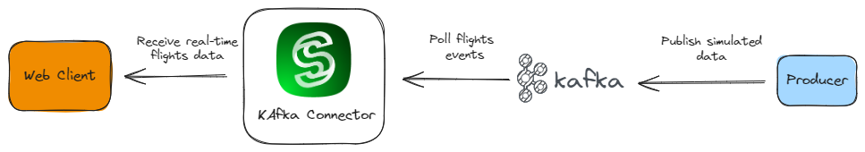
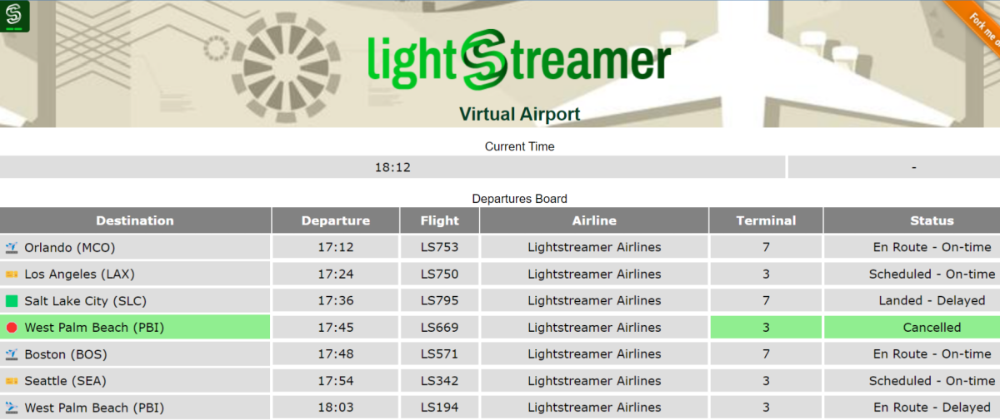

# Kafka Connector Airport Demo

This project includes the resources needed to develop the Kafka Connector Airport Demo.

<br>

The Demo simulates a basic departures board consisting of a few rows, each representing flight departure information from a hypothetical airport.
The simulated data, inputted into a [Kafka cluster](https://kafka.apache.org/), is fetched and injected into the Lightstreamer server via [Kafka Connector](https://github.com/Lightstreamer/Lightstreamer-kafka-connector).

The demo project consists of:
- A web client designed to visualize the airport departure board from a browser.
- A random flight information generator that acts as a message producer for Kafka.
- Files to configure the Kafka Connector according to the needs of the demo.

## The Web Client

The web client, contained in the folder [`client/web`](client/web/) uses the [Web Client SDK API for Lightstreamer](https://lightstreamer.com/api/ls-web-client/latest/) to handle the communications with Lightstreamer Server. A simple user interface is implemented to display the real-time data received from Lightstreamer Server.

<br>
### [ View live demo](https://demos.lightstreamer.com/AirportDemo/)

The demo basically executes a single [Subscription](https://lightstreamer.com/api/ls-web-client/latest/Subscription.html) with a item subscribed to in **COMMAND** mode feeding a [DynaGrid](https://lightstreamer.com/api/ls-web-client/latest/DynaGrid.html) with the current list and status of the next departing flights (according to the simulated time).
The subdcribed item is:
```javascript
itemsList = [ "flights-board" ];
```
The table is then kept sorted by departure time by setting the [setSort](https://lightstreamer.com/api/ls-web-client/latest/DynaGrid.html#setSort) call of the DynaGrid object.

The mapping between Kafka topic and Lightstreamer item is one-to-one.

```xml
        <!-- Map the topic "Flights" to the "flights-board" item. -->
        <param name="map.Flights.to">flights-board</param>
```

To optimally manage subscriptions in **COMMAND** mode, the special configuration `fields.evaluate.as.command.enable` is used. This activates the automatic verification that the `key` and `command` fields, necessary for this subscription mode, are present and have consistent values.

```xml
<!-- Enable support for COMMAND mode. -->
<param name="fields.evaluate.as.command.enable">true</param>
```

And then the Lightstreamer client library automatically manages the board's updates based on the 'ADD', 'DELETE', and 'UPDATE' types of the received updates.

## The Producer

The source code of the producer is basically contained in the `producer` package, which generates random information for the flights and acts as the producer versus the Kafka cluster. In particular, the following classes are defined:

- `DemoPublisher.java`: class that implements the simulator generating and sending flight monitor data to a Kafka topic; the messages sent to Kafka will also have a key composed of the flight number to which the information refers.
- `FlightInfo.java`: class that defines all the flight-related information to be displayed on the departure board, and will be serialized into JSON format as a Kafka message.
- `Snapshot.java`: class that defines a specific type of message used for snapshot management. In particular, it contains a 'command' field which can take the following values: 'CS', indicating a clear snapshot operation used to simulate the end of the day, and 'EOS', used to indicate the end of the messages required to reconstruct the snapshot image for the item. 

## Connector Configurations

In the [`connector`](connector/) folder, we found the configuration files needed to configure the Kafka Connector:

- `adapters.xml`: in this file, parameters are essentially configured for the connector to consume messages from Kafka, and the mapping between Kafka cluster topics and Lightstreamer items that the client will subscribe to is defined. In the specific case of this demo, message serialization occurs via JSON objects, and therefore, the mapping of fields from the received JSON object to the Lightstreamer item fields to be sent to clients is also defined. In particular, the section defining the field mapping is this one:
  ```xml
    <data_provider name="AirportDemo">
      ...

      <!-- Enable support for COMMAND mode. -->
      <param name="fields.evaluate.as.command.enable">true</param>

      <!-- Extraction of the record value attributes mapped to corresponding field names. -->
      <param name="field.key">#{KEY}</param>
      <param name="field.command">#{VALUE.command}</param>

      <param name="field.destination">#{VALUE.destination}</param>
      <param name="field.departure">#{VALUE.departure}</param>
      <param name="field.flightNo">#{VALUE.flightNo}</param>
      <param name="field.terminal">#{VALUE.terminal}</param>
      <param name="field.status">#{VALUE.status}</param>
      <param name="field.airline">#{VALUE.airline}</param>
      <param name="field.currentTime">#{VALUE.currentTime}</param>

      ...
    </data_provider>
  ```
- `log4j.properties`: in this file, you'll find the specific configuration for the Kafka Connector log, to obtain details about all interactions with the Kafka cluster and the message retrieval operations, along with their routing to the subscribed items in the Lightstreamer server. In this demo, a specific log file named `airport.log` is configured, destined for the same `logs` folder as the other Lightstreamer logs.

## Setting up the Demo

### Kafka Cluster

The demo needs a Kafka cluster where a topic `Flights` is created. You can use either a locally installed instance of Kafka in your environment, starting perhaps from the latest release of Apache Kafka as explained [here](https://kafka.apache.org/quickstart), or an installation of Confluent Platform (you can find a quickstart [here](https://docs.confluent.io/platform/current/platform-quickstart.html)). Alternatively, you can use one of the cloud services that offer fully managed services such as [Confluent Cloud](https://docs.confluent.io/cloud/current/get-started/index.html) or [AWS MSK](https://aws.amazon.com/msk/?nc2=type_a).
Based on this choice, you will need to modify the [`adapters.xml`](connector/adapters.xml) files accordingly, particularly the `bootstrap server` parameter. The proposed configuration assumes a local Kafka installation that does not require authentication or the use of TLS communication:

```xml
<data_provider name="AirportDemo">
    <!-- ##### GENERAL PARAMETERS ##### -->

    <adapter_class>com.lightstreamer.kafka.adapters.KafkaConnectorDataAdapter</adapter_class>

    <!-- The Kafka cluster address -->
    <param name="bootstrap.servers">localhost:9092</param>

  ...

</data_provider>
```

However, in more complex scenarios where authentication and TLS need to be set up, please refer to the Kafka Connector guide [here](../../README.md#broker-authentication-parameters) and [here](../../README.md#encryption-parameters).

The demo leverages a particular data retention mechanism to ensure simplified snapshot management.
The mechanism is compaction, which takes advantage of the fact that the demo uses key-based messages, allowing the Kafka cluster to maintain only one value per key, the most recent one, in the message history.
Further details on this mechanism can be found [here](https://developer.confluent.io/courses/architecture/compaction/#).

To configure our `Flights` topic to be managed in a compacted manner, the following steps are necessary:

1. Set up the Kafka cluster to support this mode, ensuring that the `server.properties` file contains this setting:
   ```java
   log.cleanup.policy=compact, delete
   ```

2. Create the topic with the following configurations:
   ```sh
   $ ./bin/kafka-topics.sh --bootstrap-server localhost:9092 --create --topic Flights \
              --replication-factor 1 \
              --partitions 1 \
              --config cleanup.policy=compact \
              --config segment.ms=30000

   $ ./bin/kafka-configs.sh --bootstrap-server localhost:9092 --entity-type topics --entity-name Flights --describe
   ```

### Lightstreamer Server

- Download Lightstreamer Server version 7.4.2 or later (Lightstreamer Server comes with a free non-expiring demo license for 20 connected users) from [Lightstreamer Download page](https://lightstreamer.com/download/), and install it, as explained in the `GETTING_STARTED.TXT` file in the installation home directory.
- Make sure that Lightstreamer Server is not running.
- Deploy a fresh installation of the Lightstreamer Kafka Connector following the instructions provided [here](../../README.md#deploy).
- Replace the `adapters.xml` file with the one of this project and in the case update the settings as discussed in the previous section.
- [Optional] Customize the logging settings in the log4j configuration file `log4j.properties`.
- Launch Lightstreamer Server.

### Simulator Producer loop

To build the simulator you have two options: either use [Gradle](https://gradle.org/) (or other build tools) to take care of dependencies and build (recommended) or gather the necessary jars yourself and build it manually.
For the sake of simplicity, only the Gradle case is detailed here.

#### Gradle

You can easily build the producer by running the following command from the [`producer`](producer/) folder:

```sh
$ ./gradlew clean build
```

which generates the _uber_ jar. Then, you can start the simulator producer loop with this command:

```sh
$ java -jar build/libs/example-kafka-connector-demo-publisher-all-1.0.0.jar localhost:9092 Flights 1000
```

where:
- `localhost:9092` is the bootstrap string for connecting to Kafka and for which the same considerations made above apply.
- `Flights` is the topic name used to produce the messages with simulated flights info.
- `1000` is the interval in milliseconds between the generation of one simulated event and the next.

### Web Client

In order to install a web client for this demo pointing to your local Lightstreamer Server, follow these steps:

* Deploy this demo on the Lightstreamer Server (used as Web server) or in any external Web Server.

  If you choose the former, create the folders `<LS_HOME>/pages/demos/airport70` (you can customize the last two digits based on your favorite movie in the series) and copy here the contents of the `client/web/src` folder of this project

>[!IMPORTANT]
> *The client demo configuration assumes that Lightstreamer Server, Kafka Cluster, and this client are launched on the same machine. If you need to target a different Lightstreamer server, please double check the `LS_HOST` variable in [`client/web/src/js/const.js`](client/web/src/js/const.js) and change it accordingly.*

* Open your browser and point it to [http://localhost:8080/airport70](http://localhost:8080/airport70).

## Setting Up on Docker Compose

To simplify the setup, we have also provided two different Docker Compose files to showcase the demo against  [_Apache Kafka_](https://hub.docker.com/r/apache/kafka) and [_Redpanda Self-Hosted_](https://docs.redpanda.com/current/get-started/quick-start/):

- [`docker-compose-kafka.yml`](./docker-compose-kafka.yml)
- [`docker-compose-redpanda.yml`](./docker-compose-redpanda.yml)

### Prerequisites

- JDK version 17
- Docker Compose

### Run

1. From the `examples/airport-demo` folder:

   - For running the demo against _Apache Kafka_:
     ```sh
     $ ./start_demo.sh
     ...
      ✔ Network airport-demo-kafka_default  Created
      ✔ Container broker                    Started
      ✔ Container init-broker               Started
      ✔ Container producer                  Started
      ✔ Container kafka-connector           Started
     Services started. Now you can point your browser to http://localhost:8080/AirportDemo to see real-time data.
     ```

   - For running the demo against _Redpanda Self-Hosted_:
     ```sh
     $ ./start_demo_redpanda.sh
     ...
      ✔ Network airport-demo-redpanda_default  Created
      ✔ Container redpanda                     Started
      ✔ Container redpanda-console             Started
      ✔ Container producer                     Started
      ✔ Container kafka-connector              Started
     Services started. Now you can point your browser to http://localhost:8080/AirportDemo to see real-time data.
     ```

2. Once all containers are ready, point your browser to http://localhost:8080/AirportDemo.
3. After a few moments, the user interface starts displaying the real-time flights data.
4. To shutdown Docker Compose and clean up all temporary resources:

   - For _Apache Kafka_, execute:
     ```sh
     $ ./stop_demo.sh
      ✔ Container kafka-connector           Removed
      ✔ Container init-broker               Removed
      ✔ Container producer                  Removed
      ✔ Container broker                    Removed
      ✔ Network airport-demo-kafka_default  Removed
     ```

   - For _Redpanda Self-Hosted_, execute:
     ```sh
     $ ./stop_demo_redpanda.sh
     ...
      ✔ Container redpanda-console             Removed
      ✔ Container kafka-connector              Removed
      ✔ Container producer                     Removed
      ✔ Container redpanda                     Removed
      ✔ Network airport-demo-redpanda_default  Removed
     ```