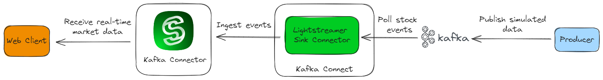

# Quick Start for Kafka Connect

This folder contains the resources required to build a version of the [_Quick Start_]((../../README.md#quick-start-set-up-in-5-minutes)) app based on Kafka Connect Lightstreamer Sink Connector.



The diagram above illustrates how, in this setup, a stream of simulated market events is channeled from Kafka to the web client via the connector running on Kafka Connect and Lightstreamer Server.

As with the original Quickstart application, this app is structured as a Docker Compose stack. The Docker Compose file comprises the following services:

1. _broker_: a Kafka broker, based on the [Docker Image for Apache Kafka](https://kafka.apache.org/documentation/#docker). 

2. _kafka-connect-lightstreamer-sink_: Kafka Connect Lightstreamer Sink Connector, based on the [Kafka Connect Lightstreamer Sink Connector Docker image example](../docker-kafka-connect/).

3. _schema-registry_: Schema Registry, based on the [_Confluent Docker Image for Schema Registry_](https://hub.docker.com/r/confluentinc/cp-schema-registry).

4. _lightstreamer_: Lightstreamer Server, which also includes a web client mounted on `/lightstreamer/pages/QuickStart`.

5. _producer_: a native Kafka Producer, based on the provided [`Dockerfile`](examples/quickstart-producer/Dockerfile) file from the [`quickstart-producer`](examples/quickstart-producer/) producer sample client.

## Run

1. Make sure you have Docker, Docker Compose, and Java 17 (or later) installed on your local machine.

2. From this directory, run the following:

   ```sh
   $ ./start-connect.sh
   ...
   ✔ Network quickstart-kafka-connect_default  Created                                               
   ✔ Container broker                          Started                                     
   ✔ Container schema-registry                 Started                                
   ⠋ Container lightstreamer                   Starting                                                                 
   ⠹ Container producer                        Starting                            
   ✔ Container kafka-connect                   Created  
   ...
   Services started. Now you can point your browser to http://localhost:8080/QuickStart to see real-time data.
   ...
   ```

3. Once all containers are ready, point your browser to [http://localhost:8080/QuickStart](http://localhost:8080/QuickStart).

4. After a few moments, the user interface starts displaying the real-time stock data.

   

5. To shutdown Docker Compose and clean up all temporary resources:

   ```sh
   $ ./stop-connect.sh
   ```
