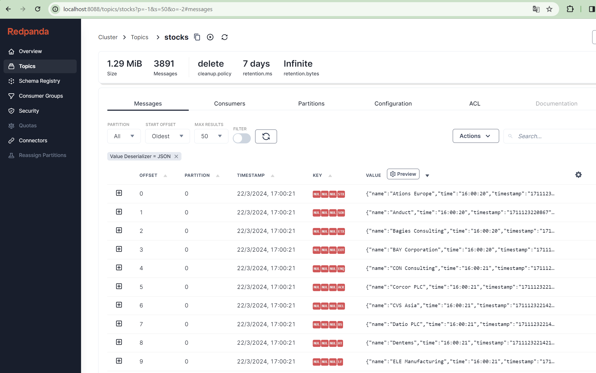

# Quick Start Redpanda Self-hosted

This folder contains a variant of the [_Quick Start_](../../README.md#quick-start-set-up-in-5-minutes) app configured to use _Redpanda_ as the target broker.

The [docker-compose.yml](docker-compose.yml) file has been revised to realize the integration with [Redpanda Self-hosted](https://docs.redpanda.com/current/get-started/quick-start/).
In particular, the previous `broker` service has been replaced with the following definition:

```yaml
broker:
  command:
    - redpanda
    - start
    - --kafka-addr internal://0.0.0.0:29092,external://0.0.0.0:19092
    # Address the broker advertises to clients that connect to the Kafka API.
    # Use the internal addresses to connect to the Redpanda brokers'
    # from inside the same Docker network.
    # Use the external addresses to connect to the Redpanda brokers'
    # from outside the Docker network.
    - --advertise-kafka-addr internal://broker:29092,external://localhost:19092
    - --pandaproxy-addr internal://0.0.0.0:8082,external://0.0.0.0:18082
    # Address the broker advertises to clients that connect to the HTTP Proxy.
    - --advertise-pandaproxy-addr internal://broker:8082,external://localhost:18082
    - --schema-registry-addr internal://0.0.0.0:8081,external://0.0.0.0:18081
    # Redpanda brokers use the RPC API to communicate with each other internally.
    - --rpc-addr broker:33145
    - --advertise-rpc-addr broker:33145
    # Mode dev-container uses well-known configuration properties for development in containers.
    - --mode dev-container
    # Tells Seastar (the framework Redpanda uses under the hood) to use 1 core on the system.
    - --smp 1
    - --default-log-level=info
  image: docker.redpanda.com/redpandadata/redpanda:v23.3.9
  container_name: broker
  ports:
    - 18081:18081
    - 18082:18082
    - 19092:19092
    - 19644:9644
```

which is a slightly modified version of `redpanda-0` service included in the [`docker-compose.yml`](https://docs.redpanda.com/redpanda-labs/docker-compose/_attachments/single-broker/docker-compose.yml) file provided by the [_Redpanda Self-hosted Quick Start_](https://docs.redpanda.com/current/get-started/quick-start/)

## Run

From this directory, follow the same instructions you can find in the [Quick Start](../../README.md#run) section of the main README file.

## Explore the Topic

In [`docker-compose.yml`](docker-compose.yml#L60) we have also deployed [_Redpanda Console_](https://redpanda.com/redpanda-console-kafka-ui), which is running on port `8088`:

```yaml
console:
  container_name: redpanda-console
  image: docker.redpanda.com/redpandadata/console:v2.4.5
  entrypoint: /bin/sh
  command: -c 'echo "$$CONSOLE_CONFIG_FILE" > /tmp/config.yml; /app/console'
  environment:
    CONFIG_FILEPATH: /tmp/config.yml
    CONSOLE_CONFIG_FILE: |
      kafka:
        brokers: ["broker:29092"]
        schemaRegistry:
          enabled: true
          urls: ["http://broker:8081"]
      redpanda:
        adminApi:
          enabled: true
          urls: ["http://broker:9644"]
      server:
        listenPort: 8088
  ports:
    - 8088:8088
  depends_on:
    - broker
```

To explore the topic:

- open your browser and navigate to [http://localhost:8088](http://localhost:8080)
- go to `Topics` > `stocks`

and see the messages produced along with other details about the topic.

